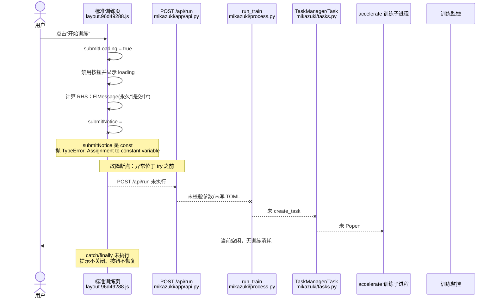

# Issue #206 白盒问题报告：点击开始训练后卡在“任务正在提交中”

## 1. 结论

Issue #206 的直接根因是前端训练提交函数把 `submitNotice` 声明为 `const`，随后又尝试重新赋值：

```javascript
const ..., submitLoading = ref(false), submitNotice = null, ...

submitNotice = ElMessage(...)
```

浏览器因此同步抛出：

```text
TypeError: Assignment to constant variable.
at O (layout.96d49288.js:14:14082)
```

异常发生在 `try` 语句之前，所以：

- `POST /api/run` 从未发出。
- 后端不会生成 TOML、创建 Task 或启动训练子进程。
- 前端 `catch` 与 `finally` 均不会执行。
- 永久消息“任务正在提交中，请稍等”不会关闭。
- `submitLoading` 不会恢复，开始训练按钮持续处于 loading/disabled。
- 训练监控保持“当前空闲”，GPU 和任务管理器没有训练负载。

这是一个前端运行时状态变量声明错误，不是模型、数据集、GPU、训练脚本或监控服务故障。影响范围是复用该标准训练提交组件的训练页面，并非仅 LoKr 参数组合。

## 2. 调研范围与基线

- Issue：<https://github.com/wochenlong/lora-scripts-next/issues/206>
- Issue 创建时间：2026-07-24
- 调研仓库：`wochenlong/lora-scripts-next`
- 本地路径：`lora-scripts-next/`
- 基线提交：`1592b11545b58e21f962aa13e54fda1d7c529f92`
- 基线标签：`v2.9.0`
- v2.9.0 发布时间：2026-07-23
- Codegraph：356 files，11,285 nodes，22,849 edges
- 约束：仅静态白盒分析；未安装依赖、未启动应用、未修改业务代码

## 3. Issue 证据

### 3.1 用户现象

Issue 正文描述：点击开始训练后只出现“任务提交中，请稍后”，后台没有报告，训练监控没有运行消耗，任务管理器也没有占用。

多名用户确认同一问题。维护者在 2026-07-27 确认问题存在，并说明它是修复 LoKr 导入问题时产生的附加 bug。

### 3.2 截图证据

第一张截图显示：

- 页面为 `http://127.0.0.1:28000/lora/sd3.html`，即 Anima 标准 LoRA 页面。
- 参数预览已正常生成，`model_train_type = "anima-lora"`。
- 点击后出现永久提示“任务正在提交中，请稍等”。
- “开始训练”按钮处于 loading/disabled 状态。

第二张截图显示训练监控：

- 地址为 `127.0.0.1:6008`。
- 状态为“当前空闲”。
- 没有模型类型、进度、Epoch、耗时或 Loss。
- GPU 负载约 2%，符合训练进程未创建的表现。

评论补充截图显示 Chrome Console 唯一错误：

```text
TypeError: Assignment to constant variable.
    at O (layout.96d49288.js?...:14:14082)
    ...
```

截图顶部仍显示“任务正在提交中，请稍等”，与异常发生点完全吻合。

## 4. 项目相关架构

该链路由四层组成：

1. 预编译 Vue 前端：`frontend/dist/assets/layout.96d49288.js`
2. FastAPI 提交接口：`mikazuki/app/api.py` 的 `POST /api/run`
3. 训练任务调度：`mikazuki/process.py::run_train`
4. 子进程与状态：`mikazuki/tasks.py::{TaskManager, Task}`，训练监控读取任务/日志状态

前端源码未作为正常可维护源代码存在于当前交付链路中；仓库通过 `scripts/patch_config_import_layout.py` 对压缩后的 dist bundle 做字符串替换。这使变量声明边界和运行时语义容易在补丁过程中被破坏。

## 5. 单链路图



## 6. 逐节点白盒分析

### 6.1 点击处理器入口

`frontend/dist/assets/layout.96d49288.js:14` 中的压缩函数 `O=async()=>{...}` 是“开始训练”按钮处理器。其预期流程为：

```javascript
if (submitLoading.value) return;
submitLoading.value = true;
setSubmitButtonLoading(true);
submitNotice = ElMessage({
  message: "任务正在提交中，请稍等",
  duration: 0,
  type: "info"
});
try {
  // parse params and POST /api/run
} catch (...) {
  // close notice and show network error
} finally {
  // close notice and reset loading
}
```

提示先成功出现，是因为 JavaScript 会先计算赋值右侧 `ElMessage(...)`，然后才把返回值写入左侧 `submitNotice`。因此 UI 能创建提示，随后在赋值阶段抛错。

### 6.2 变量声明冲突

同一个 `setup` 函数稍早使用一条 `const` 声明链：

```javascript
const r = usePageFrontmatter(),
      ...,
      submitLoading = ref(false),
      submitNotice = null,
      setSubmitButtonLoading = ...;
```

所以 `submitNotice` 不可重新赋值。截图中的 `Assignment to constant variable` 正是 ECMAScript 对该操作的标准异常。

### 6.3 为什么错误逃逸了 `catch/finally`

危险语句位于 `try {` 之前：

```javascript
submitNotice = ElMessage(...);
try {
  ...
} catch (...) {
  ...
} finally {
  ...
}
```

因此本函数自己的异常处理范围没有覆盖状态初始化。结果是：

- `submitNotice.close()` 不执行。
- `submitLoading.value = false` 不执行。
- `setSubmitButtonLoading(false)` 不执行。

### 6.4 请求没有到达 `/api/run`

`await post("/api/run", ...)` 位于上述 `try` 内部，在故障语句之后。由于同步异常先发生，请求不可能执行。

这解释了用户所说“后台没任何报告”：不是后端吞错，而是后端接口没有收到本次训练提交。

### 6.5 正常后端路径为何没有活动

若请求正常到达，`mikazuki/app/api.py:622-740` 会：

- 解析 JSON 并规范化参数。
- 校验训练类型、数据目录和模型路径。
- 写入 `config/autosave/<timestamp>.toml`。
- 调用 `process.run_train(...)`。

`mikazuki/process.py:203-287` 随后会：

- 构造 accelerate 命令。
- 调用 `tm.create_task(...)`。
- 后台执行 `task.execute()` 和 `task.wait()`。
- 立即向前端返回 task ID 与日志 URL。

`mikazuki/tasks.py:156-190` 的 `Task.execute()` 最终通过 `subprocess.Popen(...)` 创建训练进程，并把状态从 `CREATED` 改为 `RUNNING`。

本 Issue 在进入这些步骤前已经失败，所以后台日志、Task 列表、训练子进程和监控指标都不会出现。

## 7. 引入机制与时间线

- 2026-06-05：`06ea830` / `32dadd4` 首次加入训练提交 loading 反馈。
- 2026-07-22：`b8f3957` 处理 LoKr 配置 guard，与维护者所述“修复 LoKr 导入”背景一致。
- 2026-07-23：`cf43220` 合并 LoKr 导入、预览和持久提交反馈，并进入 v2.9.0。
- 2026-07-23：v2.9.0 发布。
- 2026-07-24：Issue #206 创建。

当前补丁脚本 `scripts/patch_config_import_layout.py:315-321` 包含：

```python
# Repair the short-lived invalid v2.9.0 patch before applying idempotent rules.
text = text.replace(
    "const submitNotice=ElMessage(",
    "submitNotice=ElMessage(",
    1,
)
```

这说明开发过程中曾出现另一种错误形态，即在逗号表达式中插入 `const submitNotice=...`。最终 tag 中该语法形态已被改掉，但 `submitNotice` 仍处于外层 `const` 声明链，运行时重新赋值依然非法。

因此完整引入机制是：对压缩 dist 的字符串补丁为了保存持久消息句柄，引入了一个需要重新赋值的普通变量，但它被拼入既有 `const` 声明链。静态文本最终语法合法，却运行时语义错误。

## 8. 为什么发布验收未发现

`tests/test_train_submit_loading_static.py:8-32` 只用 `assertIn` 检查字符串：

- 有 `submitNotice=null`。
- 有 `submitNotice=ElMessage(...)`。
- 有 `submitNotice.close()`。
- 有 `finally` 和 loading 恢复语句。

测试没有验证：

- `submitNotice` 是否可写。
- 点击处理器能否实际执行到 `POST /api/run`。
- `ElMessage` 返回后是否抛运行时异常。
- 失败时按钮与永久消息是否恢复。
- bundle 在浏览器环境中的行为。

因此“需要赋值”与“声明为 const”这两个字符串可以同时满足所有静态断言，形成 48 PASS / 0 FAIL 但核心路径不可用的情况。

## 9. 影响范围

### 9.1 直接影响

标准训练页面共用 `layout.96d49288.js` 的 `MainPage` 和同一个 `O` 提交处理器，因此受影响的不只是截图中的 Anima：

- Anima 标准 LoRA
- Stable Diffusion / SDXL LoRA
- Flux 等复用标准参数页和提交按钮的页面

截图评论中的 `/lora/master.html` 同样复现，证明它不是 Anima/LoKr 后端专属问题。

### 9.2 不在根因范围内

- 训练监控：它正确显示没有运行任务。
- GPU/驱动：训练进程从未创建，GPU 空闲是结果而非原因。
- 数据目录和模型路径：后端校验尚未执行。
- accelerate / trainer：命令尚未构造和启动。
- `anima-lokr-config-guard.js`：它只清洗 LoKr TOML 预览/下载，不拦截训练提交请求。

## 10. 修复方向建议

本报告不修改代码。建议修复时遵循以下最小原则：

1. 将 `submitNotice` 变为可重新赋值的绑定，或使用 `ref` 保存句柄；不要把可变句柄拼入 `const` 声明链。
2. 把 loading 状态设置和消息句柄创建纳入 `try/finally` 覆盖范围，保证任何同步异常都能恢复 UI。
3. 增加真实浏览器级点击测试，断言一次点击会发出一次 `POST /api/run`。
4. 测试成功、API 失败、网络失败和参数转换同步异常四条路径，均应关闭提示并恢复按钮。
5. 对最终交付的 dist bundle 做运行时 smoke test，而不只做字符串存在性测试。
6. 长期停止直接字符串修补压缩 bundle，恢复可构建的前端源码和常规类型检查/打包链路。

## 11. 建议验收条件

- 点击“开始训练”后 Network 面板出现一次 `POST /api/run`。
- API 成功后提示切换为“训练已开始”，按钮恢复，`/api/tasks` 出现任务。
- API 返回 fail 时显示后端 message，按钮和提示均恢复。
- 请求异常或参数转换异常时按钮和提示均恢复。
- Anima、Stable Diffusion/SDXL、Flux 标准页至少各执行一次 smoke test。
- 浏览器 Console 无 `Assignment to constant variable`。

## 12. 置信度与限制

根因置信度：**高**。

依据是截图中的精确异常、bundle 中完全匹配的声明与赋值、异常位置相对 `try` 和 `POST /api/run` 的顺序，以及监控空闲等外部表现的逐项闭环。

本次遵守“白盒分析、不安装、不运行项目、不改代码”的约束，未对训练环境做动态复现。该限制不影响对当前前端异常根因的判断。

## 13. 修复实施记录

后续修复在分支 `fix/issue-206-train-submit` 实施：

- 将 `submitNotice` 改为 `ref(null)`，通过 `.value` 保存可变消息句柄。
- 将 `ElMessage(...)` 创建移入 `try`，同步异常也由 `finally` 恢复 UI。
- 在 `finally` 中空值保护地关闭消息、清空句柄并恢复按钮状态。
- 同步更新 dist bundle、补丁生成脚本和静态回归测试。
- 使用 `node --check` 验证最终交付 bundle 的 JavaScript 语法。
- 重复执行补丁脚本，验证生成过程可重入。

该修复不改变请求负载、API 路由、后端任务创建或训练命令，只修正前端提交反馈的状态生命周期。
