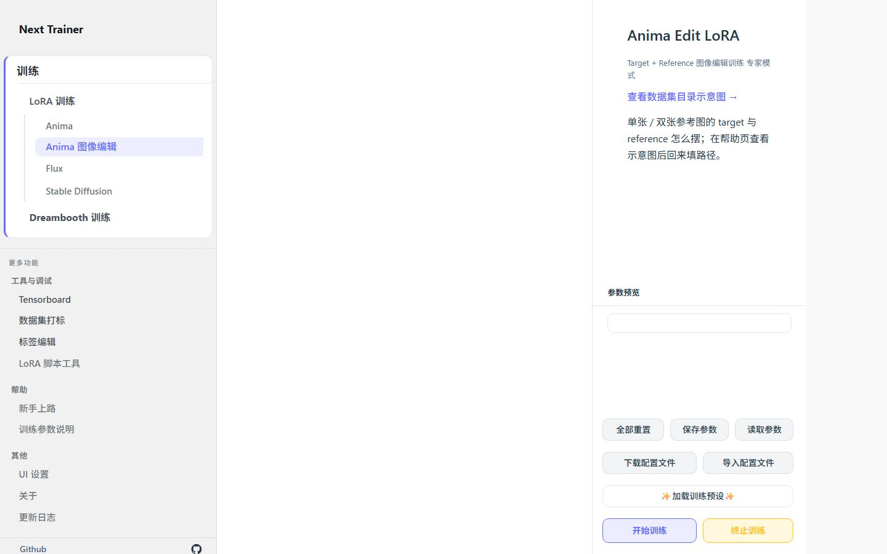
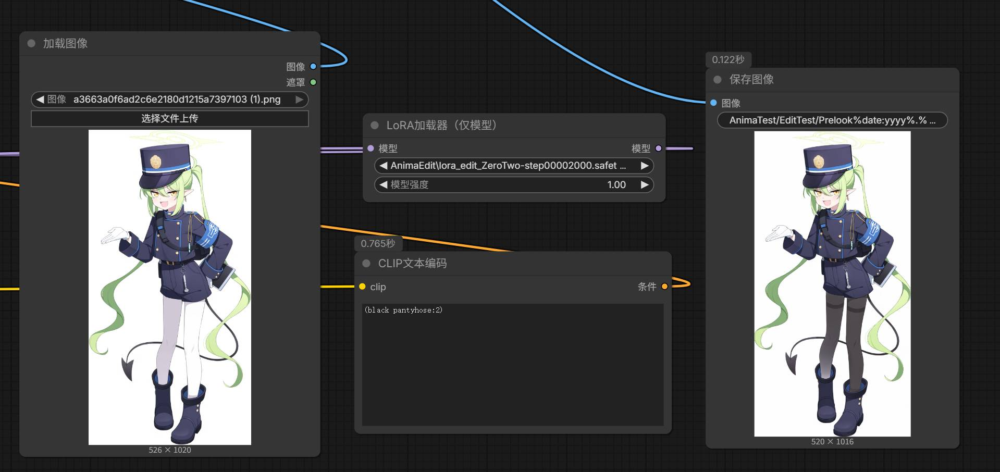
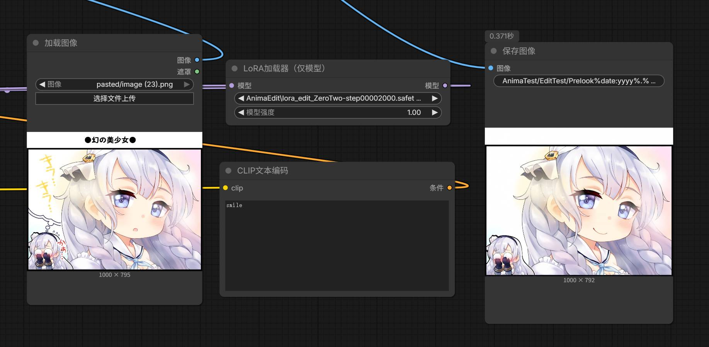
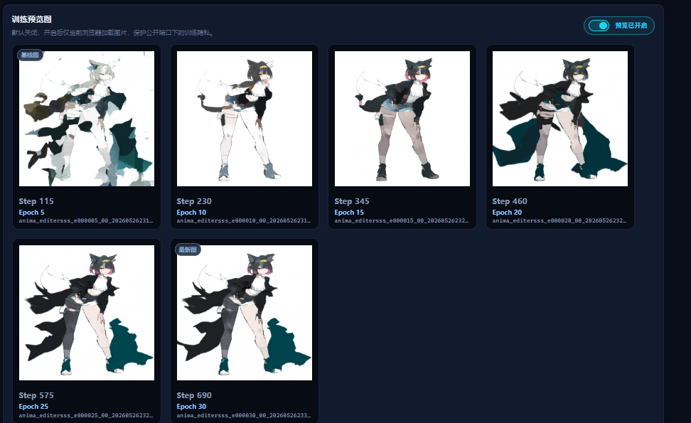

<p align="center">
  
</p>

<h1 align="center">Next Trainer: Anima Edit 分支</h1>

<p align="center">
  <b>Anima 图像编辑 / 条件训练实验分支</b><br/>
  在 WebUI 中训练成对 Target / Reference 数据集，并用 Control Image 预览编辑效果。<br/>
  <sub>基于 Next Trainer、kohya-ss/sd-scripts，以及 <a href="https://github.com/Mirumo0u0/sd-scripts">Mirumo0u0/sd-scripts</a> 的 conditioning 实现。</sub>
</p>

<p align="center">
  <a href="https://github.com/wochenlong/lora-scripts-next/tree/anima-edit"></a>
</p>

<p align="center">
  <a href="https://github.com/wochenlong/lora-scripts-next"></a>
  <a href="https://github.com/wochenlong/lora-scripts-next/blob/main/LICENSE"></a>
</p>
<p align="center">
  <a href="https://github.com/wochenlong/lora-scripts-next/blob/anima-edit/README.md"><b>English (README)</b></a>
</p>
<p align="center">
  <a href="https://github.com/wochenlong/lora-scripts-next/blob/anima-edit/NOTICE.md"><b>致谢 & 许可</b></a>
</p>

---

<p align="center">
  
</p>

<p align="center"><sub>全新 UI — 左侧栏导航，中栏模型 & 参数表单，右栏实时配置预览</sub></p>

---

## Anima 图像编辑（实验功能）

`anima-edit` 分支加入了 Anima 条件训练 / 图像编辑训练入口和后端支持。在 Anima 页面开启 **图像编辑（实验功能）** 后，可以配置成对数据集：

- **目标图目录 Target**：放置希望模型学习生成的目标图片，以及同名 `.txt` / `.json` 标签。
- **参考图目录 Reference / Conditioning**：放置输入参考图，文件名和尺寸需与目标图一致。
- **图像编辑预览**：使用专属编辑 Prompt + 固定或随机抽取的 Control Image；宽高、CFG、步数、采样器和预览频率复用普通训练预览图设置。

快速入口：

- 代码分支：需要切到 `anima-edit`，普通 `main` 分支和当前 Release 整合包没有这套后端。
- 训练教程：见 [Anima 图像编辑 / 条件训练教程](docs/anima-training.md#图像编辑--条件训练实验)。
- 推理使用：训练出的 LoRA 可在 ComfyUI 中配合 [Mirumo0u0/ComfyUI-Cosmos-Reference](https://github.com/Mirumo0u0/ComfyUI-Cosmos-Reference) 节点使用，为 Anima / Cosmos 系模型添加参考图输入。
- 关键约束：Target 与 Reference 的同名图片必须尺寸一致；图像编辑模式会自动启用 latent / text encoder 缓存，并关闭 step 0 预览。

<p align="center">
  
</p>

<p align="center"><sub>Anima 图像编辑控件：Target / Reference 数据集路径，以及 Control Image 预览输入。</sub></p>

<p align="center">
  
</p>

<p align="center"><sub>Anima 图像编辑的参考图驱动预览流程示例。</sub></p>

<p align="center">
  
</p>

<p align="center"><sub>示例图片由 <b>古柯C17H21NO4</b> 提供，感谢他提供用于说明图像编辑流程的图片素材。</sub></p>

### 实验限制说明

本分支的 Anima Edit 是在 **Anima 文生图基座上进行 conditioning LoRA 训练**，不是 Qwen Image Edit 这类专门训练过的图像编辑基础模型。因此它能验证“参考图到目标图”的训练链路，但在局部边界、遮挡关系和细节稳定性上，精度上限通常会低一些。

如果预览图在后期反复出现固定位置的黑块、污渍、色块或结构漂移，通常应优先视为小数据集过拟合信号，而不是 WebUI 显示问题。建议选择更早的 checkpoint，降低 `unet_lr`，减少 epoch，或准备更干净、更多样的成对数据集。

<p align="center">
  
</p>

<p align="center"><sub>小数据集训练中的过拟合示例：有效学习阶段之后，局部色块伪影会逐渐固定并加重。</sub></p>

> WebUI 训练会自动生成 conditioning dataset TOML，并在图像编辑预览 prompt 中写入 `--cn <control image>`。详细说明见 [docs/anima-training.md](docs/anima-training.md)。
> 后端 conditioning 实现参考 [Mirumo0u0/sd-scripts](https://github.com/Mirumo0u0/sd-scripts)（kohya-ss/sd-scripts 的 Apache-2.0 fork）；本项目保留其许可证文本、来源说明与必要致谢。

---

## 运行这个分支

```
1. 克隆  →  git clone https://github.com/wochenlong/lora-scripts-next.git
2. 切分支 →  cd lora-scripts-next && git checkout anima-edit
3. 启动  →  Windows 运行 run_gui.bat；Linux 运行 bash install.bash && bash run_gui.sh
4. 训练  →  打开 http://127.0.0.1:28000，进入 Anima LoRA，开启图像编辑
```

> 当前 Release 整合包还不包含 Anima Edit，不能直接用整合包验证该功能。请先使用 `anima-edit` 源码分支；一键包仅代表已发布的主线功能。

补充：WebUI「打标」页仍继承 Next Trainer 的 WD 打标模型支持；这与 Anima Edit 训练链路相互独立。

> **要求：** Windows 10/11，NVIDIA 显卡（RTX 20+），~7 GB 磁盘。

<details>
<summary><b>完整源码命令</b></summary>

```sh
git clone https://github.com/wochenlong/lora-scripts-next.git
cd lora-scripts-next
git checkout anima-edit

# Windows
run_gui.bat

# Linux
bash install.bash && bash run_gui.sh

# 可选：安装 Flash Attention 2 加速 Anima 训练
# Windows
install_flash_attn.bat
# Linux
bash install_flash_attn.sh
```

推荐 Python **3.10**。详见 [Flash Attention 2 文档](docs/flash-attention.md)。

</details>

---

## 本分支关注什么

| 范围 | 状态 |
|------|------|
| **Anima 图像编辑** | 本分支主目标：Target / Reference 成对训练、Control Image 预览 |
| **Anima LoRA / LoKr / T-LoRA** | 继承自 Next Trainer，可在同一页面使用 |
| SD 1.5 / SDXL / Flux | 继承主线训练页面，但不是本实验分支重点 |
| Release 整合包 | 暂未包含 Anima Edit，请使用源码分支 |

---

## 图像编辑训练监控

Anima Edit 训练启动后，监控页可以帮助判断 conditioning 链路是否在有效学习：GPU 状态、训练参数、Loss 曲线、预览图、日志一站式查看。

<p align="center">
  
</p>

<p align="center"><sub>GPU 负载 & 显存、总步数、训练参数一目了然</sub></p>

<p align="center">
  
</p>

<p align="center"><sub>训练预览图 + TensorBoard 同源 Loss / LR 曲线</sub></p>

<p align="center">
  
</p>

<p align="center"><sub>实时训练日志，自动滚动</sub></p>

---

<details>
<summary><b>显存参考（Anima LoRA, 1024 分辨率, RTX 4090 实测）</b></summary>

| 显存 | 配置 | 备注 |
|------|------|------|
| ≥ 24 GB | 默认参数 | 最省心 |
| ≥ 16 GB | `gradient_checkpointing` | 推荐日常 |
| ≥ 12 GB | 梯度检查点 | 稳定 |
| ≥ 10 GB | 梯度检查点 + `blocks_to_swap=16` | 速度略降 |
| ≥ 8 GB | 梯度检查点 + swap 24 + 缓存 TE + LoKr | 极限 |

</details>

<details>
<summary><b>文档</b></summary>

| 主题 | 链接 |
|------|------|
| **Anima 图像编辑 / 条件训练教程** | [docs/anima-training.md#图像编辑--条件训练实验](docs/anima-training.md#图像编辑--条件训练实验) |
| Anima LoRA 训练指南 | [docs/anima-training.md](docs/anima-training.md) |
| Flash Attention 2 | [docs/flash-attention.md](docs/flash-attention.md) |
| 训练监控 & SSE 接口 | [docs/train-monitor.md](docs/train-monitor.md) |
| Docker 部署 | [docs/docker.md](docs/docker.md) |
| CLI 参数 | [docs/cli-args.md](docs/cli-args.md) |

</details>

---

## Next Trainer 通用仓库信息

| 位置 | 用途 |
|------|------|
| 根目录 | 仅保留契约入口 + 薄转发器，详见 [docs/repo-layout.md](docs/repo-layout.md) |
| `scripts/portable/` | 整合包启动逻辑 |
| `scripts/autodl/` | 云 GPU 运维（根目录同名文件为转发） |
| `scripts/cli/` | 旧式命令行训练（Anima 请用 WebUI） |
| `legacy/` | 打标 / notebook 等，日常可忽略 |
| `doc/local/` | 本地交接、Issue 草稿、`AGENT_INTERNAL.md`（不上传 GitHub） |
| `script/` | 本地一次性脚本（不上传 GitHub）；正式脚本在 `scripts/` |
| `docs/` | 公开文档（含 AutoDL 部署等） |

---

## 通用问题（非 Anima Edit 专属）

<details>
<summary><b>无法运行 run_gui.ps1 / 未数字签名</b></summary>

推荐直接双击 `run_gui.bat`。如果一定要运行 `.ps1`：

```powershell
powershell -ExecutionPolicy Bypass -File .\run_gui_source.ps1
```

</details>

<details>
<summary><b>解压后路径嵌套两层</b></summary>

若路径出现 `...\lora-scripts-next-2.5.0\lora-scripts-next-2.5.0\`，请进入内层含 `run_gui.bat` 的目录。

</details>

<details>
<summary><b>torch 安装失败 / No matching distribution</b></summary>

**源码安装**（`run_gui.bat` 首次自动装依赖、或手动 `install-cn.ps1`）常见原因：

1. **Python 版本不对** — 需要 **3.10 或 3.11、64 位**。3.12/3.13 没有对应 CUDA 预编译包，pip 会报「找不到匹配版本」。
2. **仓库太旧** — 若脚本里仍是 `torch 2.0.x + cu118`，请 `git pull` 到最新，或改用 [Releases](https://github.com/wochenlong/lora-scripts-next/releases) 整合包。
3. **半装坏的 venv** — 删掉项目下的 `venv` 文件夹后重装。

**不想折腾环境**：直接下载 **SD-Trainer-v2.x.7z** 整合包，解压双击 `run_gui.bat`（内置 Python，无需自装 torch）。

重装示例（PowerShell，在项目根目录）：

```powershell
Remove-Item -Recurse -Force venv -ErrorAction SilentlyContinue
py -3.10 -m venv venv
.\venv\Scripts\activate
powershell -ExecutionPolicy Bypass -File .\install-cn.ps1
```

</details>

<details>
<summary><b>打标模型放在哪 / 还要下载吗</b></summary>

- **默认模型**：`wd14-convnextv2-v2`（HuggingFace：`SmilingWolf/wd-v1-4-convnextv2-tagger-v2`，revision `v2.0`）
- **缓存路径**：项目根目录 `huggingface/hub/`（环境变量 `HF_HOME=huggingface`）
- **整合包**：发布 7z 已内置，一般无需再下
- **源码**：首次 `install-cn.ps1` 会预下载；之后每次 `run_gui.bat` 启动前若缺失会自动补下。手动：`python scripts/prefetch_default_tagger.py`

</details>

<details>
<summary><b>整合包：能开网页但无法开始训练（v2.5.2）</b></summary>

请升级到 **v2.5.3** 整合包，不要继续用 v2.5.2。说明与保留用户数据步骤见 [`docs/portable-upgrade-2.5.2-to-2.5.3.md`](docs/portable-upgrade-2.5.2-to-2.5.3.md)（[Issue #54](https://github.com/wochenlong/lora-scripts-next/issues/54)）。

</details>

<details>
<summary><b>整合包更新后打不开 / 启动脚本过时</b></summary>

整合包布局固定为：根目录 `run_gui.bat` + `python_embeded/` + `SD-Trainer/`。

- **用 `Update-SD-Trainer.bat` 拉代码后**：脚本会尝试刷新根目录 `run_gui.bat`；若仍失败，从新 Release 解压覆盖，或手动运行 `SD-Trainer\scripts\portable\sync_portable_root_launchers.bat`。
- **只解压过旧 7z、没有 `SD-Trainer\scripts\portable\`**：需下载新版 7z，或至少用新版替换整个 `SD-Trainer` 文件夹与根目录 `run_gui.bat`。
- 实际启动逻辑在 `SD-Trainer\scripts\portable\launch_portable.bat`，随项目更新，不要删改 `python_embeded` / `SD-Trainer` 文件夹名。

</details>

---

<details>
<summary><b>更新日志</b></summary>

| 日期 | 版本 |
|------|------|
| 2026-05-21 | **v2.5.0** — UI 焕新：侧栏导航重构、首页传送门、训练监控仪表盘新增 GPU 指标；CSS 去重清理 |
| 2026-05-21 | **v2.4.0** — 训练稳定性：环境隔离、NaN 过滤、采样保护、attn_mode 降级、路径规范化；整合包 tkinter 修复 |
| 2026-05-20 | **v2.3.0** — 训练监控升级：TensorBoard 同源曲线、参数速查、日志同步 |
| 2026-05-19 | **v2.2.0** — 整合包 flash-attn 治本、闪退日志、跨盘监控 |
| 2026-05-19 | **v2.1.0** — Flash Attention 2 预编译 wheel、按步数保存 |
| 2026-05-18 | **v2.0.0** — 整合包首发、AMD 检测、bf16 修复 |

详见 [CHANGELOG.md](CHANGELOG.md)。

</details>

<details>
<summary><b>致谢</b></summary>

[Akegarasu/lora-scripts](https://github.com/Akegarasu/lora-scripts) · [kohya-ss/sd-scripts](https://github.com/kohya-ss/sd-scripts) · [LyCORIS](https://github.com/KohakuBlueleaf/LyCORIS) · [T-LoRA](https://github.com/ControlGenAI/T-LoRA) — 完整归属见 [NOTICE.md](NOTICE.md)

</details>

---

<p align="center"><sub>维护者：<b><a href="https://github.com/wochenlong">@wochenlong</a></b> · <a href="CONTRIBUTORS.md">贡献者</a></sub></p>
