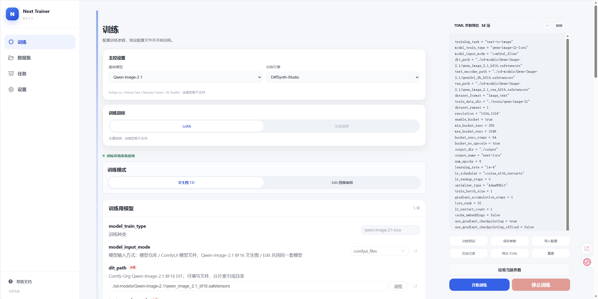

# Next Trainer

**多引擎 AI 模型训练工作台。**

[English](README.md) · [下载](https://github.com/wochenlong/lora-scripts-next/releases) · [使用文档](#开始使用) · [更新记录](docs/dev-progress.md) · [未来规划](docs/roadmap.md)

## 是什么

Next Trainer 把数据集管理、打标、标签编辑、训练配置与任务监控放进同一个 Web 界面，面向需要本地训练或通过浏览器操作远程训练服务器的用户。

项目延续秋叶训练器的使用体验，接入 Kohya、Anima Fast、Musubi 等训练引擎，目标是一个专业、可扩展的训练工作台，而不是为每个模型维护一套独立界面。

> 你正在阅读 **`dev` 开发分支**。这里的能力可能尚未进入正式整合包；日常使用请优先选择 [Release](https://github.com/wochenlong/lora-scripts-next/releases)，不要把开发分支进度等同于已发布版本。

*界面示例；实际选项以所用版本及引擎为准。*

## 能做什么

| 工作环节 | 当前能力 |
| --- | --- |
| 数据集 | 创建与自动发现数据集，上传图片及 TXT、多层文件夹，冲突预检、失败重试、ZIP 导出与回收站 |
| 打标与编辑 | 本地 WD 系列打标、图片与标签联动编辑，同一数据集在管理、打标、编辑间流转 |
| 训练 | 按模型、引擎和训练目标组织参数，TOML 预览与导入导出，LoRA 或受支持模型的全量微调 |
| 任务监控 | 训练队列、任务状态、日志、Loss 与预览图；保留 TensorBoard 作为查看方式 |
| 引擎管理 | 按需管理训练环境，搜索与筛选引擎、拖拽排序、每页五项；排序在当前浏览器保存 |

### 模型与引擎

各引擎能力不同，**接入引擎不等于支持其上游的所有模型和训练模式**。

| 引擎 | 主要训练入口 | 说明 |
| --- | --- | --- |
| Kohya | SD 1.5、SDXL、Flux、Anima | 支持范围随模型而异；已接入独立环境管理 |
| Anima Fast | Anima 2B / 2.9B LoRA | 独立运行环境；两种规格有明确的底模路径入口 |
| Musubi | Krea 2 LoRA | 可选安装；Linux 多卡见专项指南 |
| DiffSynth | Qwen-Image-2.1 文生图 / 图像编辑 LoRA | 当前为单卡 BF16；Edit 使用 Batch 1 |

Anima 默认路径仅用于引导，**不代表已下载权重**。模型、数据集、GPU 显存及依赖仍需按所选引擎准备。

使用细节：[Anima](docs/anima-training.md) · [Anima Fast](docs/anima-fast.md) · [Krea 2](docs/krea2-linux-multigpu.md) · [DiffSynth / Qwen](docs/diffsynth.md)

## 开始使用

**使用整合包：** 从 [Releases](https://github.com/wochenlong/lora-scripts-next/releases) 选择适合的包，按包内说明启动，然后打开 `http://127.0.0.1:28000`。不同包预装的环境不同，底模通常需要另行准备。

**使用开发源码：** 参考环境说明后切换到 `dev`，Windows 使用 `run_gui.bat`；已准备好 Python 环境时可运行 `python gui.py`。前端开发与构建见 [frontend/README.md](frontend/README.md)。

| 需要什么 | 去哪里 |
| --- | --- |
| 安装与整合包说明 | [快速开始](docs/portable-getting-started.md) |
| 数据集路径、上传与删除规则 | [开发版功能说明](docs/dev-progress.md#dataset-workspace) |
| 打标模型与存放位置 | [打标模型](docs/tagger-models.md) |
| 监控与命令行使用 | [训练监控](docs/train-monitor.md) · [CLI](docs/cli-args.md) |
| 开发与整合包构建 | [仓库布局](docs/repo-layout.md) · [构建指南](docs/portable-build-guide.md) |

## 我们做了什么

近期已合入 `dev` 的重点：

- **数据集工作区：** 托管目录、保留层级的上传、冲突集中处理、导出与可恢复删除。
- **图像编辑训练：** DiffSynth / Qwen-Image-2.1 接入目标图与参考图训练流程。
- **Anima 路径引导：** Anima 2B / 2.9B 分别记住默认与自定义路径，导入配置保留原路径。
- **引擎环境与界面：** Kohya 独立环境管理；紧凑列表、搜索筛选、持久化拖拽排序与五项分页。
- **可靠性：** 加固环境安装检查、配置边界与整合包更新流程。

详见 [开发进展与当前限制](docs/dev-progress.md)；历史版本说明见 [CHANGELOG](CHANGELOG.md) 和 [Releases](https://github.com/wochenlong/lora-scripts-next/releases)。

### 接下来做什么

| 阶段 | 方向 |
| --- | --- |
| **3.2.0** | 完善数据集、预处理、打标和标签编辑工作流，持续接入模型 |
| **3.3.0** | 推进 AI Toolkit 的完整产品接入与验收 |
| **后续 3.x** | 更新机制、EXE 客户端、API 打标、训练产物发布；具体版本待定 |
| **4.0.0** | Agent 正式支持从数据准备到训练、测试的完整工作流 |

以上是目标，不是完成声明或发布日期承诺。已合入部分与待完成项见 [路线图](docs/roadmap.md)。

## 参与项目

遇到问题请在 [Issues](https://github.com/wochenlong/lora-scripts-next/issues) 提供版本或提交号、模型与引擎、复现步骤和日志。分享日志前请移除令牌与私人数据。

感谢原项目与各训练引擎作者，以及所有贡献者。[开源致谢](docs/credits.md) · [NOTICE](NOTICE.md) · [贡献者](CONTRIBUTORS.md)
