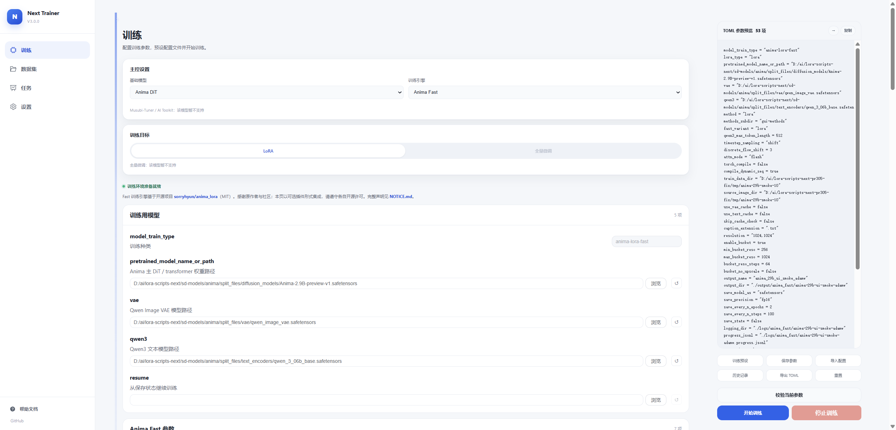

  

  <strong>A local training workbench for multiple models and engines</strong> 
  Prepare datasets, train models, and follow your runs in one place.

  <a href="https://github.com/wochenlong/lora-scripts-next/releases">Download</a> ·
  <a href="docs/getting-started.en.md">Quick start</a> ·
  <a href="docs/README.md">Documentation</a> ·
  <a href="README-zh.md">中文</a>

Anima 2.9B and the Anima Fast environment are ready, with training configuration and TOML preview side by side. [Explore the workspace](docs/interface-tour.md).

## What's new in 3.1.0

- **Anima Fast:** train Anima 2.9B and T-LoRA with a dedicated runtime.
- **Multiple engines, one workspace:** manage Kohya, Anima Fast, Musubi, and AI Toolkit from the same interface.
- **Smoother training workflows:** improved task management, configuration imports, and step/epoch handling.

[Full changelog](CHANGELOG.md) · [Anima Fast guide](docs/anima-fast.md)

## Supported models

**Anima · SD 1.5 · SDXL · Flux · FLUX.2 Klein · Krea 2**

Training targets, hardware requirements, and optional engine installation vary by model. See the [training guides](docs/README.md#training--训练).

## Get started

**Windows users:** [download a portable package](https://github.com/wochenlong/lora-scripts-next/releases), extract it, and use the included launcher. An NVIDIA GPU is required; see [setup and package selection](docs/getting-started.en.md).

**Release status:** 3.1.0 source is on `main`; the published portable release is still **v3.0.0**. Downloading that archive does not include the 3.1.0 updates. See Releases for package availability.

For the 3.1.0 source version or Linux setup, follow [run from source](docs/getting-started.en.md#from-source).

---

[Documentation](docs/README.md) · [Report an issue](https://github.com/wochenlong/lora-scripts-next/issues) · [Credits](docs/credits.md) · [Contributors](CONTRIBUTORS.md)
