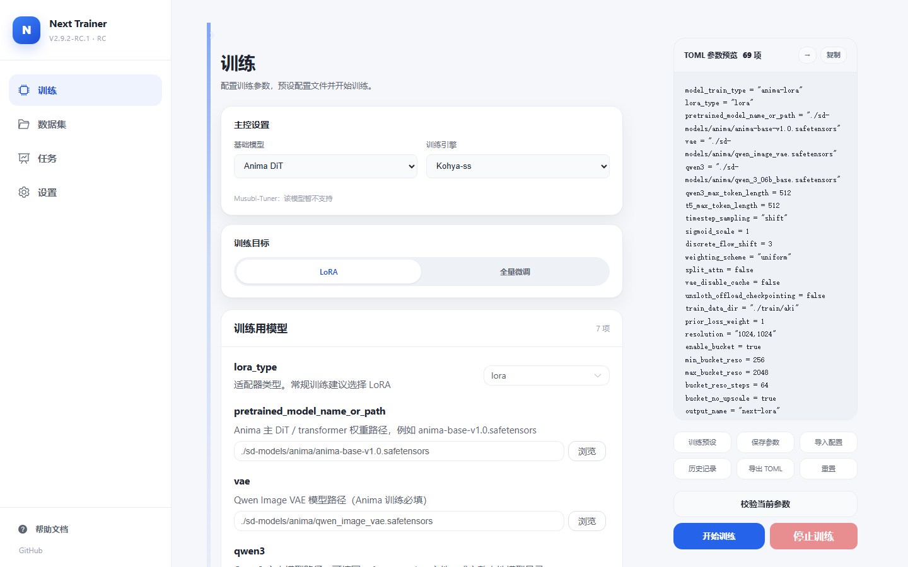
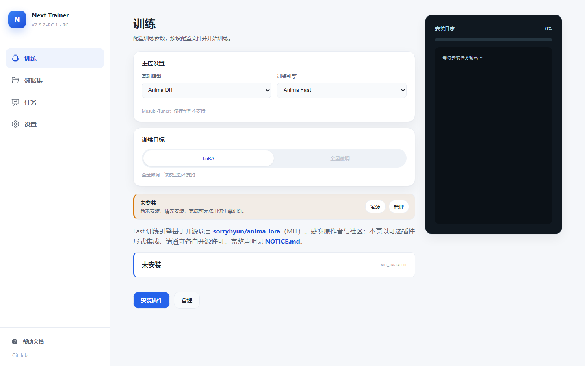
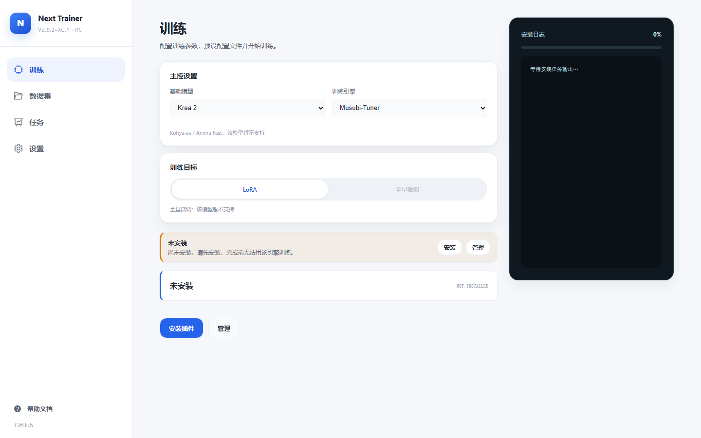
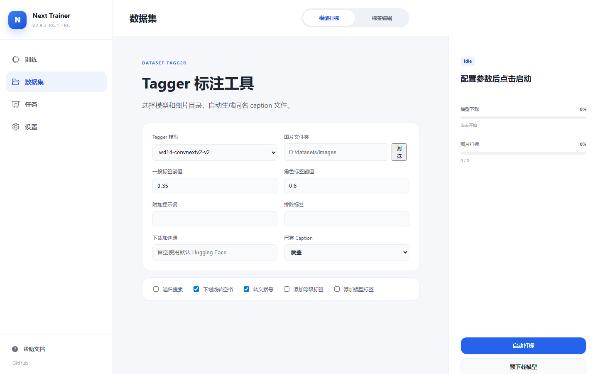
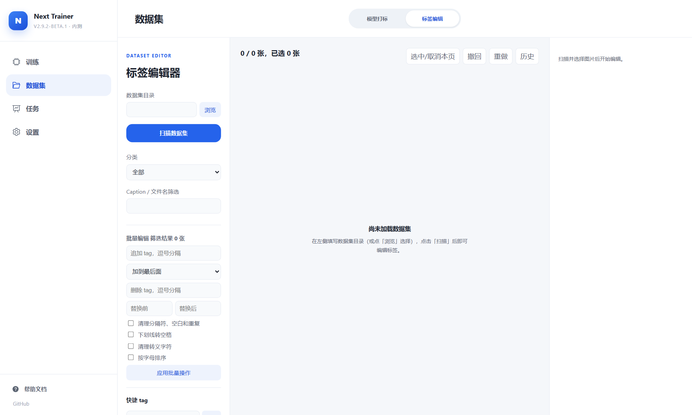
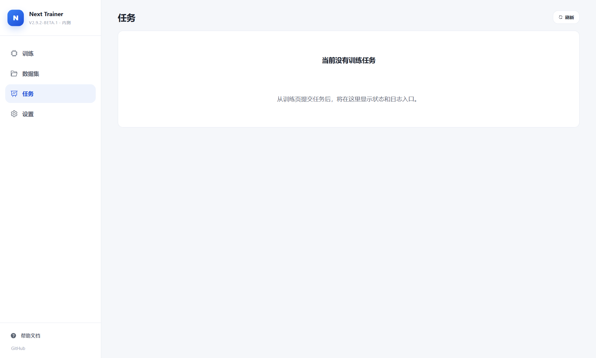
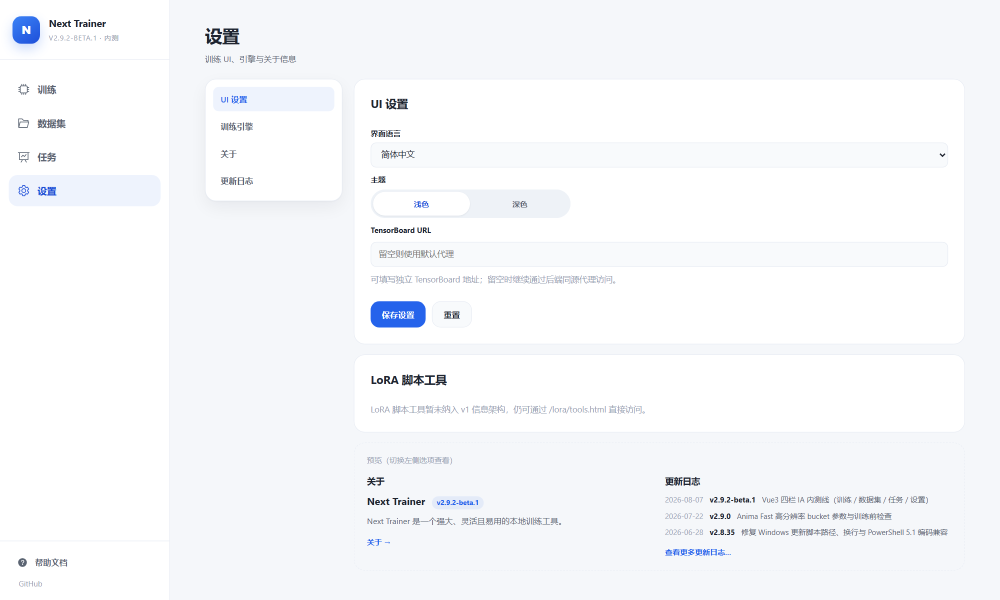
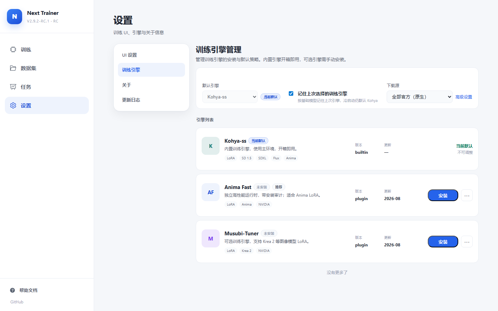

# Next Trainer

<p align="center">
  
</p>

<p align="center">
  <strong>Local model training manager</strong><br />
  Familiar training flow · Multi-engine · Agent-ready by design<br />
  <sub>For serious creators and platforms · GitHub repository <code>lora-scripts-next</code></sub>
</p>

<p align="center">
  <a href="README-zh.md">中文</a>
  ·
  <a href="docs/credits.md">Credits</a>
  ·
  <a href="CHANGELOG.md">Changelog</a>
  ·
  <a href="https://github.com/wochenlong/lora-scripts-next/releases">Releases</a>
</p>

---

## What it is

**Next Trainer** is not another thin webpage wrapped around training scripts.  
It is a **local model training manager** for serious creators and platforms: it keeps the training operations you already know, puts multiple engines under one workbench, and is designed so **agents can work with it natively**.

You still train LoRA or full finetune on a local Windows machine with an NVIDIA GPU.  
The difference is that starting runs, watching tasks, managing datasets, and switching engines no longer scatter across script windows and one-off pages. They live in one durable management surface.

The training stack stays grounded in proven backends: the main path is built on [kohya-ss/sd-scripts](https://github.com/kohya-ss/sd-scripts); for Krea 2 you can optionally plug in [musubi-tuner](https://github.com/kohya-ss/musubi-tuner).  
The public brand is **Next Trainer**, and release archives usually look like `Next-Trainer-v*.7z`. The default UI is the Vue 3 workspace at **3.0.0**, with Training, Dataset, Tasks, and Settings.

---

## What you can do

In short: tagging, caption editing, choosing a model, starting training, watching progress, and reading logs can stay in one local manager.

Training routes covered:

1. Anima LoRA  
2. Anima Fast  
3. Anima full finetune  
4. SD 1.5, SDXL, and Flux  
5. Optional Krea 2  

Local tagging, a train monitor page, and TensorBoard are included too.

### Why try this over other trainers

If you already know how to train, but are tired of one environment per engine, a pile of windows per run, and humans talking past scripts, Next Trainer is built for that gap.

1. **Familiar operations**  
   Pick a model, fill parameters, import TOML, start training, watch previews. The path stays close to Akegarasu-style habits, so you do not relearn everything just to get a new shell.

2. **Multiple engines, one management surface**  
   Kohya is the baseline. Optional engines such as Anima Fast and Musubi install and switch from Settings. Studios and platforms do not need a separate UI for every backend.

3. **Agent-ready by design**  
   Configs import and export cleanly, tasks and logs are machine-readable, and the workspace stays stable. People can click the UI; agents can follow the same flow instead of bolting automation on afterward.

4. **Runs stay visible**  
   Status, logs, previews, and Loss live on the Tasks page. After training starts, you do not need a stack of external windows just to watch the run.

5. **For people who train seriously, and for platforms that integrate**  
   Individuals can stay on the portable package. Teams, platforms, and early testers can build on source, `main`, or `dev` for integration and long-term maintenance.

This is not a cloud one-click platform, and it does not pretend to replace every specialized tool.  
What it aims to be is simpler: a professional, extensible manager for local model training that both people and agents can use.

---

## Features

### Training

1. Pick a base model  
2. Pick an engine  
3. Pick a training target  
4. Preview TOML on the right  
5. Validate, import or export, then start training

### Dataset

1. Run WD14 tagging  
2. Edit tags in an image-first editor  
3. Use filters and batch actions in the right panel

### Tasks

Watch the task list, status, logs, preview images, and Loss. This is the main page for following a run.

### Settings

1. Theme and UI prefs  
2. Engine management  
3. Download mirrors  
4. About and changelog

### Rough VRAM guidance

1. **Anima LoRA**  
   Supports LoRA, LoKr, and T-LoRA. Starts around 12 GB.

2. **Anima Fast**  
   Optional separate runtime. 16 GB or more is recommended. Install it in Settings.

3. **Anima full finetune**  
   Full DiT. About 24 GB is recommended.

4. **SD 1.5 and SDXL**  
   LoRA and full finetune.

5. **Flux**  
   LoRA.

6. **Krea 2**  
   LoRA through Musubi. Install the engine in Settings. Multi-GPU works on Linux.

More detail: [Anima training docs](docs/anima-training.md).

Related docs:

1. [Anima Fast](docs/anima-fast.md)  
2. [Krea 2 multi-GPU](docs/krea2-linux-multigpu.md)

### Screenshots

These shots are from the Vue 3 UI with the Chinese locale.

<details open>
<summary><strong>Training</strong></summary>

| Kohya or Anima standard | Anima Fast | Krea 2 |
|---|---|---|
|  |  |  |

</details>

<details>
<summary><strong>Dataset</strong></summary>

| Tagger | Tag editor |
|---|---|
|  |  |

</details>

<details>
<summary><strong>Tasks</strong></summary>



</details>

<details>
<summary><strong>Settings</strong></summary>

| UI prefs | Engines |
|---|---|
|  |  |

</details>

---

## Downloads, setup, and other notes

### Downloads

**3.0.0 formal packages** are still being prepared. Later builds will cover lite, Kohya, Musubi, and similar flavors on GitHub and ModelScope.

You can use the RC packages now to try Vue 3:

1. GitHub: [v2.9.2-rc.1-0813](https://github.com/wochenlong/lora-scripts-next/releases/tag/v2.9.2-rc.1-0813)  
2. ModelScope: [windsing/next-trainer-portable](https://modelscope.cn/datasets/windsing/next-trainer-portable)

Rough sizes:

1. lite about 0.39 GB  
2. kohya-musubi about 4.2 GB

Example ModelScope path:

```text
releases/v2.9.2-rc.1-0813/Next-Trainer-v2.9.2-rc.1-0813-kohya-musubi.7z
```

If you want the old UI, download [v2.9.1](https://github.com/wochenlong/lora-scripts-next/releases/tag/v2.9.1).

Runtime needs:

1. Windows 10 or Windows 11  
2. NVIDIA GPU, RTX 20-series or newer recommended  
3. Extract to a path without Chinese characters and without spaces

More reading:

1. [Portable getting started](docs/portable-getting-started.md)  
2. [Tagger models](docs/tagger-models.md)  
3. [Build and release](docs/portable-build-guide.md)

### Start from a portable package

1. Extract the archive  
2. Run `run_gui.bat`. If the package names another launcher, follow that  
3. Open http://127.0.0.1:28000  
4. A formal 3.0.0 build should show `v3.0.0` in the sidebar. RC builds may still show an rc mark

### Run `main` from source

```sh
git clone https://github.com/wochenlong/lora-scripts-next.git
cd lora-scripts-next
git checkout main
git pull

./run_gui.bat
```

Or:

```sh
python gui.py --dev
```

Check the version:

```sh
git branch --show-current
cat VERSION
```

Frontend source lives in `frontend/`. It uses Vue 3 and Vite.

```sh
cd frontend
npm install
npm run dev
npm run build
```

`npm run dev` needs the backend already running.  
`npm run build` writes into `frontend/dist`.

### Which branch to use

1. **`main`**  
   Current default stable line. Vue 3 workspace. Version **3.0.0**.

2. **`dev`**  
   Where new work lands first. Also Vue 3, and it may move ahead of `main`.

3. **`legacy/v2.9.1`**  
   Backup of the old UI. Use this only when you need the old frontend.

Follow the experiment line:

```sh
git fetch origin
git switch dev
git pull
```

Note: `main`, `dev`, and `legacy` use different frontend layouts.  
Do not mix uncommitted `frontend/dist` hotfixes across them.  
Portable users can stay on the package version and skip branch switching.

### Why `main` moved from the old UI to Vue 3

Vue 3 already soaked on `dev`, and the important gate bugs were fixed.  
Promoting it keeps one brand and one page structure, and puts stable fixes and later formal portables on the same default line.

A few launcher contracts stay for now. The portable folder is still named `SD-Trainer/`, and updater bat filenames stay as they are so older installs keep working.

Merging source into `main` does not mean a formal 7z ships the same day. Formal portables still come from [GitHub Releases](https://github.com/wochenlong/lora-scripts-next/releases).

If you want the old UI:

1. Source branch: [legacy/v2.9.1](https://github.com/wochenlong/lora-scripts-next/tree/legacy/v2.9.1)  
2. Pre-cutover snapshot: [legacy-v2.9.1-pre-vue3](https://github.com/wochenlong/lora-scripts-next/releases/tag/legacy-v2.9.1-pre-vue3)  
3. Legacy portable: [v2.9.1](https://github.com/wochenlong/lora-scripts-next/releases/tag/v2.9.1)

```sh
git fetch origin
git switch legacy/v2.9.1
```

### Doc index

1. [Credits](docs/credits.md)  
2. [NOTICE](NOTICE.md)  
3. [Portable getting started](docs/portable-getting-started.md)  
4. [Build and release](docs/portable-build-guide.md)  
5. [Tagger models](docs/tagger-models.md)  
6. [Train monitor](docs/train-monitor.md)  
7. [Repo layout](docs/repo-layout.md)

### FAQ

**What should a bug report include**

Please include:

1. The full version from the sidebar  
2. The base model, engine, and training target you used  
3. Steps to reproduce  
4. Relevant logs  

Then open an [Issue](https://github.com/wochenlong/lora-scripts-next/issues).

**How do I choose lite vs kohya-musubi**

1. If your network is weak, or you want a lighter first launch, pick **lite**. Dependencies install on first run.  
2. If you want Kohya ready out of the box and need Krea 2, pick **kohya-musubi**.  
3. On both packages, Anima Fast still needs a separate install in Settings.

**Can I reuse configs between 3.0.0 and the old stable line**

Most TOML files still import.  
Navigation and local storage keys differ, so trust what the current import page shows after loading.

**Why did the UI change completely after update**

That is expected. Current `main` is Vue 3.

If you want the old UI:

1. Switch to [legacy/v2.9.1](https://github.com/wochenlong/lora-scripts-next/tree/legacy/v2.9.1)  
2. Or install the [v2.9.1 portable](https://github.com/wochenlong/lora-scripts-next/releases/tag/v2.9.1)

---

## Changelog

Full history: [CHANGELOG.md](CHANGELOG.md).  
Release notes: [Releases](https://github.com/wochenlong/lora-scripts-next/releases).

---

<p align="center">
  <sub>
    Maintainer <a href="https://github.com/wochenlong">@wochenlong</a>
    ·
    <a href="docs/credits.md">Credits</a>
    ·
    <a href="CONTRIBUTORS.md">Contributors</a>
  </sub>
</p>
