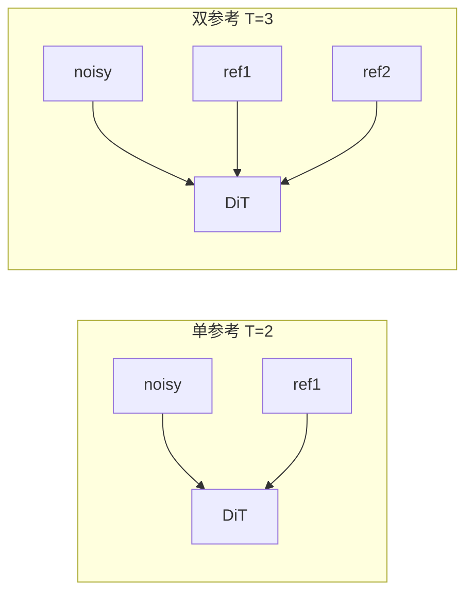

# Anima Edit 显存与训练分辨率参考

> **读者**：Anima **训练器 / conditioning 实现** 开发者——在尝试其它拼接方式、分辨率策略或缓存方案前，用本文对齐仓库现状与数据缺口。  
> **状态**：汇总已有设计、配置与开发记录；**不含**系统化「单参考 vs 双参考」对照 benchmark。  
> **分支**：`anima-edit`  
> **关联**：[anima-edit-multi-reference.md](anima-edit-multi-reference.md) · [anima-training.md](../anima-training.md#图像编辑--条件训练实验)

---

## 目录

| § | 内容 |
|---|------|
| [1](#1-结论速览) | 结论速览（分辨率 / 显存） |
| [2](#2-机制双参考为何更吃显存) | DiT 时间维 `T` 与显存 scaling |
| [3](#3-仓库内配置对照) | 单/双参考 TOML 与 UI 默认值 |
| [4](#4-已有观测非正式-benchmark) | 开发会话记录 |
| [5](#5-显存优化手段) | 可调旋钮（与实现无关） |
| [6](#6-分辨率策略) | 冒烟 → 正式训练路径 |
| [7](#7-建议补测) | 换实现前后应记录的指标 |
| [8](#8-引用索引) | 相关文件 |

---

## 1. 结论速览

### 1.1 一张表看完

| 模式 | DiT 输入时间维 `T` | 仓库内**训练分辨率**主流 | 显存数据现状 |
|:----:|:-------------------:|:------------------------|:-------------|
| **单张参考** | `T=2`<br>噪声 1 + 参考 1 | **512** — 展示 / 表情 / ImagePulse 示例<br>**1024** — `anima-edit-reference.toml` 50 epoch 探针 | 24GB 卡：**1024 + full cache** 首 step 峰值约 **22.9GB**（§4.1） |
| **双张参考** | `T=3`<br>噪声 1 + 参考 2 | **512** — P0 冒烟、全部 `*-dual-*` / `edit3` | **无**同配置单/双对照；1024 待 512 冒烟通过后验证 |

### 1.2 选型建议（在缺 benchmark 前）

| GPU 档位 | 单参考 | 双参考 |
|----------|--------|--------|
| **≥ 24GB** | 可试 **1024**（`gradient_checkpointing` + `cache_latents` + `cache_text_encoder_outputs`） | 从 **512** 起步，稳定后再试 1024 |
| **≤ 16GB** | 优先 **512** + 检查点 + TE/VAE 缓存；必要时 `blocks_to_swap`（§5） | 同上，**不要**直接上 1024 |
| **预览分辨率** | 可与训练不同；manifest `width`/`height` 可 512 训 + 1024 预览（见 `anima-training.md` ImagePulse） | 同左 |

> **给实现者的提示**  
> 若你改 conditioning 拼接（例如不沿 `dim=2` 叠参考、或改为 cross-attn 注入），下表 scaling 规律需重新推导；本文 §2 仅描述 **当前 sd-scripts 路径**。

---

## 2. 机制：双参考为何更吃显存

当前实现（`vendor/sd-scripts/anima_train_network.py`）在 conditioning 模式下，把参考图 **VAE latent** 与噪声 latent 沿 **时间维 `dim=2`** 拼接后送入 DiT：

```text
单参考：  [B, C, T=2, H, W]  =  noisy(1) + ref1(1)
双参考：  [B, C, T=3, H, W]  =  noisy(1) + ref1(1) + ref2(1)
```



**相对单参考、同一 `resolution` 时，双参考额外成本：**

| 因素 | 影响 |
|------|------|
| 前向激活 | 多 1 帧参考 latent → DiT 序列长度约 **+50%**（仅拼接维，≠ 整卡显存 +50%） |
| `cache_latents` | 每样本多缓存 1 份参考 latent |
| 预览 | manifest 可带 ref1/ref2；训练步显存与单参考相近，采样仍按 manifest 分辨率 |

**Scaling 直觉（换实现前可作 baseline）：**

- 分辨率：`512 → 1024` 边长 ×2 → 单帧 latent 面积约 **×4**
- 条件帧数：`T=2 → T=3` → 条件侧输入约 **×1.5**

---

## 3. 仓库内配置对照

### 3.1 单张参考图

| 来源 | `resolution` | `max_bucket_reso` | 备注 |
|------|:------------:|:-----------------:|------|
| WebUI `anima-edit-lora.ts` | `512,512` | 2048 | 文案：P0 推荐 512，正式可改 1024 |
| `apply_anima_training_defaults` | 空 → `512,512` | — | `mikazuki/app/api.py` |
| `anima-edit-single-ref-12epoch.toml` | 512 | 1024 | 32 对 showcase，12 epoch |
| `anima-edit-expression-*-epoch.toml` | 512 | 1024 | ImagePulse 表情子集 |
| `anima-edit-reference.toml` | **1024** | 2048 | 脱敏 50 epoch 探针 |
| `anima-edit-dataset.toml` | **1024** | — | 通用 dataset 模板 |
| 预览 manifest 示例 | — | — | `width`/`height` 多为 **512** |

### 3.2 双张参考图

| 来源 | `resolution` | `conditioning_multi_reference` | 备注 |
|------|:------------:|:------------------------------:|------|
| [multi-reference §2.2](anima-edit-multi-reference.md) | **512**（P0） | true | 正式 1024 **延后** |
| `anima-edit-dual-ref-smoke.toml` | 512 | dataset TOML | 2 step 冒烟 |
| `anima-edit-dual-ref-10epoch.toml` | 512 | true | |
| `anima-edit-showcase-dual-*.toml` | 512 | true | 文档例图 |
| `data/edit3` 冒烟 | 512 | true | `script/ops/prepare_edit3_multi_ref.py` |

### 3.3 公共训练参数（影响显存基线）

单/双参考示例 TOML 中反复出现：

| 参数 | 典型值 | 显存 |
|------|--------|------|
| `train_batch_size` | 1 | 基线 |
| `gradient_checkpointing` | true | ↓ 激活 |
| `cache_latents` | true | 训练步释放 VAE |
| `cache_text_encoder_outputs` | true | 训练步释放 Qwen3 |
| `network_train_unet_only` | true | 不训 TE |
| `mixed_precision` | bf16 | |
| `optimizer_type` | AdamW8bit | |
| `network_dim` / `alpha` | 4/4（示例）或 16/16（schema） | rank ↑ 略增显存 |
| `vae_chunk_size` | 64 | ↓ VAE 峰值 |
| `vae_disable_cache` | true | ↓ VAE 峰值 |
| `sample_at_first` | false | conditioning 强制，避免 step 0 双份采样 |

conditioning 模式下 WebUI/API 会强制 `cache_latents` + `cache_text_encoder_outputs`（`api.py` → `apply_anima_training_defaults`）。

---

## 4. 已有观测（非正式 benchmark）

### 4.1 单参考 · 1024 · 24GB

conditioning 接入阶段，**单参考**、latent + TE 缓存开启后，首 training step 曾观测：

| 指标 | 值 |
|------|-----|
| GPU 利用率 | ~100% |
| 显存 | **~22.9GB / 24GB** |
| 首 step | 部分配置极慢或看似卡住（缓存冷启动 + 显存压力） |

语境：`resolution` 1024、`train_batch_size=1`、`gradient_checkpointing=true`。  
**未**落盘为可复现 benchmark 脚本或日志。

### 4.2 双参考 · 512 冒烟（验收 ≠ 显存数字）

[multi-reference P0](anima-edit-multi-reference.md)：512、`gradient_checkpointing`、极小数据集 → 跑通 step / 1～2 epoch，无 shape/OOM；**未要求**记录峰值 GB。

对应：`anima-edit-dual-ref-smoke.toml` + `data/edit3`；仓库 **无** 留存 `output/` 训练日志。

### 4.3 文生图 Anima LoRA（非 Edit，仅供参考）

README-zh 中 **文生图 @ 1024**、RTX 4090 分级（**非** conditioning / Edit）：

| 显存 | 建议 |
|:----:|------|
| ≥ 24 GB | 默认 |
| ≥ 16 GB | `gradient_checkpointing` |
| ≥ 12 GB | 梯度检查点 |
| ≥ 10 GB | + `blocks_to_swap=16` |
| ≥ 8 GB | swap 24 + 缓存 TE + LoKr |

> Edit 同分辨率应 **≥ 文生图**（多 1～2 帧参考 latent + 缓存）。**不可**直接当 Edit 保证值。

---

## 5. 显存优化手段

来自 `vendor/sd-scripts/docs/anima_train_network.md` 与 WebUI schema；**换实现时**下列仍大多适用（除与 `T` 拼接强绑定的项）：

| 手段 | 说明 |
|------|------|
| 降低 `resolution` | **影响最大** |
| `gradient_checkpointing` | 默认已开 |
| `cache_latents` / `cache_text_encoder_outputs` | Edit 默认强制 |
| `split_attn` | ↓ attention 显存，变慢 |
| `blocks_to_swap` | DiT 块 CPU 交换 |
| `unsloth_offload_checkpointing` | 与 swap 互斥 |
| Adafactor | 略省于 AdamW8bit |
| 降低 `network_dim` | 示例 4，UI 默认 16 |
| 关闭 / 降低预览分辨率 | ↓ epoch 末采样峰值 |
| `gradient_accumulation_steps` | 模拟大 batch |

双参考 **1024 OOM** 时：先记录 OOM，再降分辨率或减参（[multi-reference 验收表](anima-edit-multi-reference.md)）。

---

## 6. 分辨率策略

```text
                 单参考                          双参考
           ┌─────────────────┐           ┌─────────────────┐
 探索/冒烟  │ 512（示例默认）  │           │ 512（P0 强制）   │
           ├─────────────────┤           ├─────────────────┤
 正式训练   │ 1024（探针验证） │           │ 1024（待验证）   │
           │ 需 ≥24GB 或优化  │           │ 512 稳定后再试   │
           └─────────────────┘           └─────────────────┘
 预览       │ 可与训练不同（manifest 512 或 1024）          │
           └──────────────────────────────────────────────┘
```

- **数据准备**：AISP/出图常用 **1024** 方图；训练前需 resize 或依赖 bucket。
- **Bucket**：示例 `enable_bucket=true`；`max_bucket_reso` 1024（512 训）或 2048（1024 训）。

---

## 7. 建议补测

换 conditioning 实现或分辨率策略前后，建议在同机记录：

| 待测项 | 方法 |
|--------|------|
| 单参考 @ 512 峰值 | `anima-edit-single-ref-12epoch.toml` 1～2 step + `nvidia-smi` / 训练监控 |
| 双参考 @ 512 峰值 | `anima-edit-dual-ref-smoke.toml`，对比单参考同分辨率 |
| 单 vs 双 @ 1024 | 仅 24GB+；记录 OOM 与否 |
| 预览开启峰值 | `sample_every_n_epochs=1` vs 关闭 |

**建议落盘字段**（写回 `output/<run>/` 或监控）：

`resolution` · `edit_reference_layout` / `conditioning_multi_reference` · `gpu_memory_peak_mb` · **实现版本 / commit**

---

## 8. 引用索引

| 文档 / 路径 | 内容 |
|-------------|------|
| [anima-edit-multi-reference.md](anima-edit-multi-reference.md) | 双参考 P0、512 冒烟 |
| [anima-training.md](../anima-training.md) | Edit 入口、示例索引 |
| [anima-edit-reference.toml](../examples/anima-edit-reference.toml) | 1024 单参考长训 |
| [anima-edit-dual-ref-smoke.toml](../examples/anima-edit-dual-ref-smoke.toml) | 512 双参考冒烟 |
| [anima-edit-single-ref-12epoch.toml](../examples/anima-edit-single-ref-12epoch.toml) | 512 单参考 showcase |
| `mikazuki/schema/anima-edit-lora.ts` | UI 默认 512、参考布局 |
| `README-zh.md` | 文生图 Anima LoRA 分级（非 Edit） |

---

| 日期 | 说明 |
|------|------|
| 2026-05-27 | 初版：汇总配置与开发观测 |
| 2026-05-27 | 排版优化；面向训练器实现者补充目录、mermaid、补测字段 |
