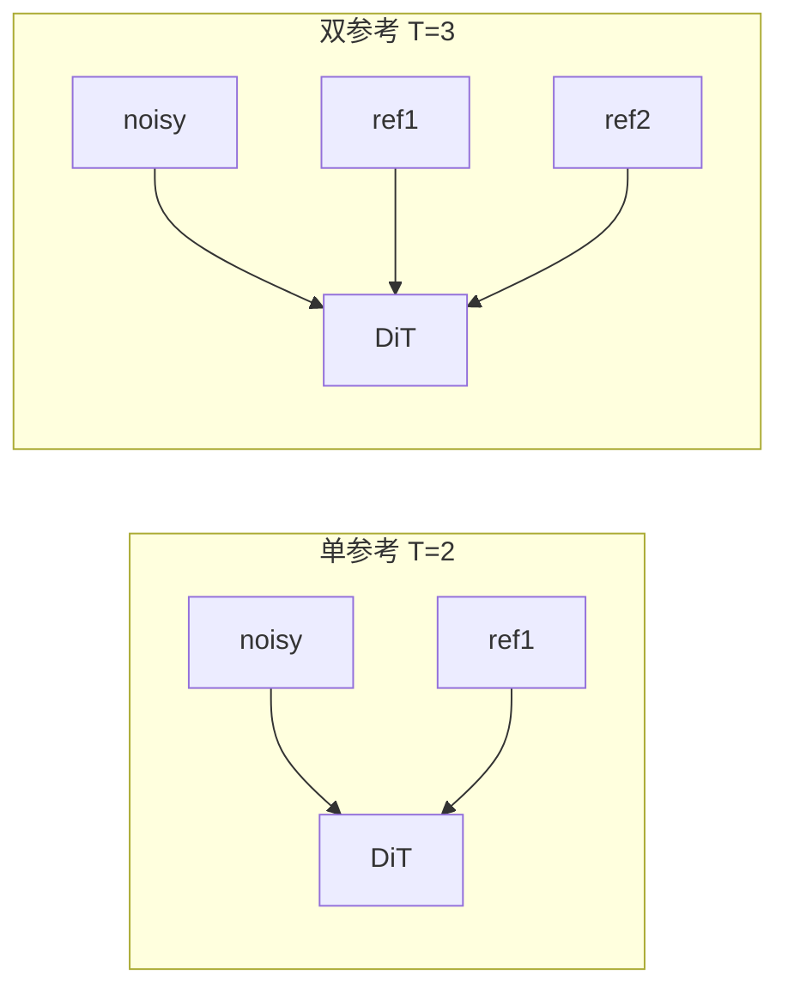

# Anima Edit 显存与训练分辨率参考

> **读者**：Anima **训练器 / conditioning 实现** 开发者——在尝试其它拼接方式、分辨率策略或缓存方案前，用本文对齐仓库现状与可复现 benchmark。  
> **分支**：`anima-edit`  
> **关联**：[anima-edit-multi-reference.md](anima-edit-multi-reference.md) · [anima-training.md](../anima-training.md#图像编辑--条件训练实验)

---

## 目录

1. [结论速览](#1-结论速览)
2. [Benchmark 矩阵（RTX 4090）](#2-benchmark-矩阵rtx-4090)
3. [机制：双参考为何更吃显存](#3-机制双参考为何更吃显存)
4. [仓库内配置对照](#4-仓库内配置对照)
5. [其它观测记录](#5-其它观测记录)
6. [显存优化手段](#6-显存优化手段)
7. [补测清单与优先级](#7-补测清单与优先级)
8. [引用索引](#8-引用索引)
9. [附录：Benchmark TOML 一览](#9-附录benchmark-toml-一览)

---

## 1. 结论速览

### 1.1 双参考 · 分辨率 vs 显存（4090，可复现）

同机、`data/edit3` 单样本、**2 epoch**、关预览、`network_dim=4`、梯度检查点 + latent/TE 缓存。详见 [§2](#2-benchmark-矩阵rtx-4090)。

| 训练分辨率 | `T` | 峰值显存 | 相对 512 双参考 |
|:----------:|:---:|---------:|----------------:|
| **512** | 3 | **~13.3 GB** | — |
| **768** | 3 | **~14.4 GB** | +~1.1 GB |
| **1024** | 3 | **~16.0 GB** | +~2.9 GB |

**24GB 卡（4090）上双参考 1024 可跑通**（本对照无 OOM）；仍建议大数据集正式训练前用目标集再 smoke 一次。

### 1.2 单参考 · 分辨率 vs 显存（4090，可复现）

| 训练分辨率 | `T` | 峰值显存 | 相对 512 单参考 |
|:----------:|:---:|---------:|----------------:|
| **512** | 2 | **~13.0 GB** | — |
| **768** | 2 | **~13.8 GB** | +~0.8 GB |
| **1024** | 2 | **~14.9 GB** | +~1.9 GB |

同 §2.3 条件下，单参考 1024 约 **14.9 GB**（非 §5.1 早期会话里的 ~22.9 GB）。

### 1.3 同分辨率：单 vs 双

| 分辨率 | 单参考 `T=2` | 双参考 `T=3` | 双参考多占 |
|:------:|:------------:|:------------:|-----------:|
| 512 | 13.0 GB | 13.3 GB | +0.2 GB |
| 768 | 13.8 GB | 14.4 GB | +0.6 GB |
| 1024 | 14.9 GB | 16.0 GB | +1.2 GB |

`T=2→T=3` 随分辨率升高略增，但**分辨率**仍是主因。

### 1.4 选型建议

| GPU | 单参考 | 双参考 |
|-----|--------|--------|
| **≥ 24 GB** | 512 / 768 / **1024** 均已跑通（§2.3） | 512 / 768 / **1024** 均已跑通（§2.1） |
| **16 GB** | 优先 512 + §6 优化项 | 优先 512；768 需自测；1024 风险高 |
| **≤ 12 GB** | 512 + `blocks_to_swap` 等 | 仅 512，勿直接 1024 |

> **换实现者**：若不再沿 `dim=2` 拼接参考 latent，§2–§3 数字需重测。

---

## 2. Benchmark 矩阵（RTX 4090）

**环境**：NVIDIA GeForce RTX 4090（24GB） · Windows · `C:\Program Files\Python310\python.exe`  
**数据**：`data/edit3` · `sample1`（target + `reference/sample1/{1,2}.png`）  
**训练**：2 epoch = 2 steps · `train_batch_size=1` · 无 `sample_every_n_epochs`  
**公共参数**：`gradient_checkpointing=true` · `cache_latents` + `cache_text_encoder_outputs` · `network_dim/alpha=4` · `AdamW8bit` · `bf16`

### 2.1 双参考（`conditioning_multi_reference=true`）

| 分辨率 | `nvidia-smi` 峰值 | 约合 | 较 512 双参考 |
|:------:|------------------:|-----:|--------------:|
| 512×512 | 13 584 MiB | 13.3 GB | — |
| 768×768 | 14 746 MiB | 14.4 GB | +1.16 GB |
| 1024×1024 | 16 434 MiB | 16.0 GB | +2.85 GB |

```text
显存 (GB, 双参考 T=3, 4090)
16.0 |                              * 1024
14.4 |                    * 768
13.3 |          * 512
     +----------------------------------
        512        768       1024   分辨率
```

**复现**

| 分辨率 | 训练 TOML | Dataset TOML |
|:------:|-----------|--------------|
| 512 | [anima-edit-vram-bench-dual-2e.toml](../examples/anima-edit-vram-bench-dual-2e.toml) | [anima-edit-dual-ref-dataset.toml](../examples/anima-edit-dual-ref-dataset.toml) |
| 768 | [anima-edit-vram-bench-dual-768-2e.toml](../examples/anima-edit-vram-bench-dual-768-2e.toml) | [anima-edit-dual-ref-dataset-768.toml](../examples/anima-edit-dual-ref-dataset-768.toml) |
| 1024 | [anima-edit-vram-bench-dual-1024-2e.toml](../examples/anima-edit-vram-bench-dual-1024-2e.toml) | [anima-edit-dual-ref-dataset-1024.toml](../examples/anima-edit-dual-ref-dataset-1024.toml) |

```powershell
# 512 单/双对照
python script/ops/bench_anima_edit_vram.py

# 768 / 1024 仅双参考（示例）
python -m accelerate.commands.launch --num_cpu_threads_per_process 1 `
  scripts/dev/anima_train_network.py --config_file docs/examples/anima-edit-vram-bench-dual-1024-2e.toml
```

日志与 JSON：`output/anima-edit-vram-bench/`（`summary.json` · `summary-dual-768.json` · `summary-dual-1024.json`）。

> 峰值为进程全程 `memory.used` 采样最大值（含加载与建缓存），非仅 forward 瞬时值。

### 2.2 单参考（`T=2`，`reference_bench_single/sample1.png`）

| 分辨率 | `nvidia-smi` 峰值 | 约合 | 较 512 单参考 |
|:------:|------------------:|-----:|--------------:|
| 512×512 | 13 349 MiB | 13.0 GB | — |
| 768×768 | 14 157 MiB | 13.8 GB | +0.79 GB |
| 1024×1024 | 15 212 MiB | 14.9 GB | +1.82 GB |

| 分辨率 | 训练 TOML | Dataset TOML |
|:------:|-----------|--------------|
| 512 | [anima-edit-vram-bench-single-2e.toml](../examples/anima-edit-vram-bench-single-2e.toml) | [anima-edit-vram-bench-single-dataset.toml](../examples/anima-edit-vram-bench-single-dataset.toml) |
| 768 | [anima-edit-vram-bench-single-768-2e.toml](../examples/anima-edit-vram-bench-single-768-2e.toml) | [anima-edit-vram-bench-single-dataset-768.toml](../examples/anima-edit-vram-bench-single-dataset-768.toml) |
| 1024 | [anima-edit-vram-bench-single-1024-2e.toml](../examples/anima-edit-vram-bench-single-1024-2e.toml) | [anima-edit-vram-bench-single-dataset-1024.toml](../examples/anima-edit-vram-bench-single-dataset-1024.toml) |

日志：`output/anima-edit-vram-bench/summary-single-768-1024.json`

### 2.3 同分辨率对照（单 `T=2` vs 双 `T=3`）

| 分辨率 | 单参考 | 双参考 | Δ（双−单） |
|:------:|-------:|-------:|-----------:|
| 512 | 13 349 MiB | 13 584 MiB | +235 MiB |
| 768 | 14 157 MiB | 14 746 MiB | +589 MiB |
| 1024 | 15 212 MiB | 16 434 MiB | +1 222 MiB |

```text
显存 (GB, 4090, 同 edit3 bench)
16 |                    *双1024
15 |              *单1024
14 |        *双768  *单768
13 |  *单512 *双512
   +--------------------------------
     512    768   1024
```

---

## 3. 机制：双参考为何更吃显存

`vendor/sd-scripts/anima_train_network.py`：参考图 VAE latent 与噪声沿 **时间维 `dim=2`** 拼接后送入 DiT。

```text
单参考：  [B, C, T=2, H, W]  =  noisy(1) + ref1(1)
双参考：  [B, C, T=3, H, W]  =  noisy(1) + ref1(1) + ref2(1)
```



| 因素 | 单→双（同分辨率） |
|------|-------------------|
| DiT 序列长度（拼接维） | 约 +50% 条件帧（≠ 整卡 +50%） |
| `cache_latents` | 多缓存 1 份参考 latent |
| 分辨率缩放 | 边长 ×2 → latent 面积约 **×4**（主因，见 §2.1） |

---

## 4. 仓库内配置对照

### 4.1 单张参考

| 来源 | `resolution` | 备注 |
|------|:------------:|------|
| WebUI `anima-edit-lora.ts` | 512（默认） | 文案可改 1024 |
| `anima-edit-single-ref-12epoch.toml` | 512 | showcase |
| `anima-edit-reference.toml` | **1024** | 50 epoch 探针 |

### 4.2 双张参考

| 来源 | `resolution` | 备注 |
|------|:------------:|------|
| [multi-reference §2.2](anima-edit-multi-reference.md) | 512（P0） | 1024 现已有 bench（§2.1） |
| `anima-edit-dual-ref-10epoch.toml` | 512 | `data/edit3` |
| `anima-edit-vram-bench-dual-*-2e.toml` | 512 / 768 / 1024 | 显存对照 |

### 4.3 公共训练参数（显存相关）

| 参数 | 典型值 |
|------|--------|
| `train_batch_size` | 1 |
| `gradient_checkpointing` | true |
| `cache_latents` / `cache_text_encoder_outputs` | true（Edit 默认强制） |
| `network_dim` / `alpha` | 4（示例）或 16（UI 默认） |
| `vae_chunk_size` / `vae_disable_cache` | 64 / true |
| `sample_at_first` | false |

---

## 5. 其它观测记录

### 5.1 单参考 · 1024 · 开发会话 vs 可复现 bench

| 来源 | 峰值 | 说明 |
|------|------|------|
| 早期开发会话 | **~22.9 GB / 24 GB** | 首 step、缓存路径修复前后；未脚本化 |
| **§2.2 可复现 bench** | **~14.9 GB**（15 212 MiB） | `network_dim=4`、全缓存、关预览、edit3 单样本 |

实现对照请以 **§2 TOML + 数字** 为准；~22.9 GB 可能含更重冷启动、不同 rank/配置或峰值采样方式差异。

### 5.2 文生图 Anima LoRA（非 Edit）

README-zh 文生图 @ 1024 的 4090 分级**不含** conditioning 多参考，勿当作 Edit 保证值。

---

## 6. 显存优化手段

| 手段 | 说明 |
|------|------|
| 降低 `resolution` | 影响最大（§2.1） |
| `gradient_checkpointing` | 默认已开 |
| `cache_latents` / `cache_text_encoder_outputs` | Edit 强制 |
| `split_attn` | ↓ attention 显存，变慢 |
| `blocks_to_swap` | DiT CPU 交换（16GB 可考虑） |
| 降低 `network_dim` | 示例 4，UI 默认 16 |
| 关闭训练预览 | ↓ epoch 末采样峰值 |

---

## 7. 补测清单与优先级

```text
           单参考                    双参考（4090 bench）
  512      ✅ ~13.0 GB               ✅ ~13.3 GB
  768      ✅ ~13.8 GB               ✅ ~14.4 GB
  1024     ✅ ~14.9 GB               ✅ ~16.0 GB
```

### 7.1 建议补测（按优先级）

| 优先级 | 项目 | 目的 | 训练 TOML | Dataset |
|:------:|------|------|-----------|---------|
| ~~**P1**~~ | ~~单参考 768 / 1024~~ | ✅ 已完成（§2.2–§2.3） | 见 §9.1 | 见 §9.1 |
| **P2** | 双参考 512 + **预览** | epoch 末 `sample` 峰值（常高于纯训练步） | [dual-512-2e-preview.toml](../examples/anima-edit-vram-bench-dual-512-2e-preview.toml) | [dual-ref-dataset.toml](../examples/anima-edit-dual-ref-dataset.toml) |
| **P2** | 双参考 512 + **`network_dim=16`** | UI 默认 rank vs bench 用的 4 | [dual-512-2e-dim16.toml](../examples/anima-edit-vram-bench-dual-512-2e-dim16.toml) | 同上 |
| **P3** | **16GB** 卡同 TOML | 验证 512/768 是否 OOM（需另机） | §9 任选 | §9 任选 |
| **P3** | **多样本** 数据集（非 edit3 单条） | 排除「仅 1 step/epoch」偏乐观 | 可 fork `anima-edit-dual-ref-10epoch.toml` | [dual-ref-dataset.toml](../examples/anima-edit-dual-ref-dataset.toml) + 扩数据 |
| **P3** | `blocks_to_swap` / `split_attn` | 16GB 降显存曲线 | 在任一 bench TOML 上加参 | — |

**不必急测**：换 conditioning 实现后整表重跑；正式长训直接看 [anima-edit-dual-ref-10epoch.toml](../examples/anima-edit-dual-ref-10epoch.toml) / [anima-edit-reference.toml](../examples/anima-edit-reference.toml) 即可。

### 7.2 落盘字段

`resolution` · `conditioning_multi_reference` · `network_dim` · `sample_every_n_epochs` · `gpu_memory_peak_mib` · **commit** → 回写 §2 表格。

---

## 8. 引用索引

| 路径 | 用途 |
|------|------|
| [anima-edit-multi-reference.md](anima-edit-multi-reference.md) | 双参考 P0 设计 |
| [anima-training.md](../anima-training.md) | Edit 训练入口 |
| [§9 TOML 一览](#9-附录benchmark-toml-一览) | 全部 bench / 正式配置路径 |
| `script/ops/bench_anima_edit_vram.py` | 一键 512 单/双 |
| `mikazuki/schema/anima-edit-lora.ts` | UI 默认 512、rank 16 |

---

## 9. 附录：Benchmark TOML 一览

> 训练入口统一为：`python -m accelerate.commands.launch --num_cpu_threads_per_process 1 scripts/dev/anima_train_network.py --config_file <下表训练 TOML>`  
> 适配器会生成同名的 `*-sd-scripts.toml`（勿手改，以训练 TOML 为准）。

### 9.1 显存 Benchmark（2 epoch · edit3 · 关预览）

| 场景 | 训练 TOML | Dataset TOML | 4090 峰值 |
|------|-----------|--------------|-----------|
| 双参考 512 | [anima-edit-vram-bench-dual-2e.toml](../examples/anima-edit-vram-bench-dual-2e.toml) | [anima-edit-dual-ref-dataset.toml](../examples/anima-edit-dual-ref-dataset.toml) | ✅ 13.3 GB |
| 双参考 768 | [anima-edit-vram-bench-dual-768-2e.toml](../examples/anima-edit-vram-bench-dual-768-2e.toml) | [anima-edit-dual-ref-dataset-768.toml](../examples/anima-edit-dual-ref-dataset-768.toml) | ✅ 14.4 GB |
| 双参考 1024 | [anima-edit-vram-bench-dual-1024-2e.toml](../examples/anima-edit-vram-bench-dual-1024-2e.toml) | [anima-edit-dual-ref-dataset-1024.toml](../examples/anima-edit-dual-ref-dataset-1024.toml) | ✅ 16.0 GB |
| 单参考 512 | [anima-edit-vram-bench-single-2e.toml](../examples/anima-edit-vram-bench-single-2e.toml) | [anima-edit-vram-bench-single-dataset.toml](../examples/anima-edit-vram-bench-single-dataset.toml) | ✅ 13.0 GB |
| 单参考 768 | [anima-edit-vram-bench-single-768-2e.toml](../examples/anima-edit-vram-bench-single-768-2e.toml) | [anima-edit-vram-bench-single-dataset-768.toml](../examples/anima-edit-vram-bench-single-dataset-768.toml) | ✅ 13.8 GB |
| 单参考 1024 | [anima-edit-vram-bench-single-1024-2e.toml](../examples/anima-edit-vram-bench-single-1024-2e.toml) | [anima-edit-vram-bench-single-dataset-1024.toml](../examples/anima-edit-vram-bench-single-dataset-1024.toml) | ✅ 14.9 GB |

单参考数据准备：`data/edit3/reference_bench_single/sample1.png`（由 `script/ops/bench_anima_edit_vram.py` 从 `reference/sample1/1.png` 复制）。

### 9.2 变体 Benchmark（待测）

| 场景 | 训练 TOML | 说明 |
|------|-----------|------|
| 双参考 512 + 预览 | [anima-edit-vram-bench-dual-512-2e-preview.toml](../examples/anima-edit-vram-bench-dual-512-2e-preview.toml) | `sample_every_n_epochs=1` |
| 双参考 512 + dim16 | [anima-edit-vram-bench-dual-512-2e-dim16.toml](../examples/anima-edit-vram-bench-dual-512-2e-dim16.toml) | 对齐 WebUI 默认 rank |

### 9.3 正式训练示例（非显存 bench）

| 用途 | 训练 TOML | Dataset |
|------|-----------|---------|
| 双参考 512 · 10 epoch | [anima-edit-dual-ref-10epoch.toml](../examples/anima-edit-dual-ref-10epoch.toml) | [anima-edit-dual-ref-dataset.toml](../examples/anima-edit-dual-ref-dataset.toml) |
| 双参考 2 step 冒烟 | [anima-edit-dual-ref-smoke.toml](../examples/anima-edit-dual-ref-smoke.toml) | 同上 |
| 单参考 showcase 12 epoch | [anima-edit-single-ref-12epoch.toml](../examples/anima-edit-single-ref-12epoch.toml) | [anima-edit-single-ref-dataset.toml](../examples/anima-edit-single-ref-dataset.toml) |
| 单参考 1024 长训探针 | [anima-edit-reference.toml](../examples/anima-edit-reference.toml) | [anima-edit-dataset.toml](../examples/anima-edit-dataset.toml) |

---

| 日期 | 说明 |
|------|------|
| 2026-05-27 | 初版与 512 单/双对照 |
| 2026-05-27 | 768 / 1024 双参考 benchmark；§2 矩阵 |
| 2026-05-27 | §7 补测清单；§9 附全量 TOML；补齐单参考 768/1024 与 preview/dim16 配置 |
| 2026-05-27 | P1：单参考 768/1024 实测；§2.3 同分辨率对照表 |
