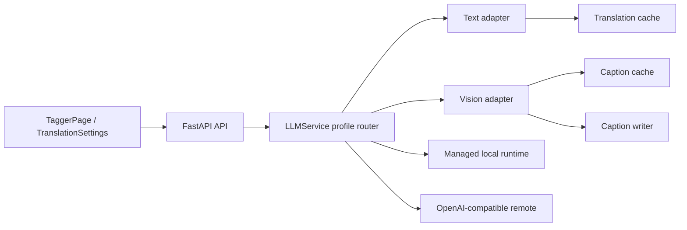

# 数据集自然语言打标与统一 LLM 接入设计书

## 计划元数据

- Plan ID: `DATASET-NL-TAGGING-20261006`
- Version: `v2.0-preflight-audit`
- Last updated: 2026-10-06 Asia/Shanghai
- Canonical progress file: `docs/tasks/natural-language-captioning-task-book.md`
- Related task book: `docs/tasks/tag-translation-task-book.md`
- Current branch: `feat/NL-Captioning`
- Current active phase: Phase 2 前端与编辑器；Phase 0/1 完成门通过
- Execution readiness: `executing`（已收到完整交付 goal）
- Scope: Dataset Tagger、Dataset Editor、统一 LLM 配置/运行时、提示词与结果写回

## 1. 目标与完成口径

用户可以在现有“数据集 → 模型打标”页面选择三种模式：

1. **Tag 标签**：沿用 WD14/CL Tagger，生成逗号分隔的训练标签。
2. **自然语言描述**：调用本地视觉模型、本地 OpenAI 兼容服务或远程视觉 API，为每张图片生成可编辑的自然语言 caption。
3. **组合打标**：先生成 Tag，再生成自然语言描述，按可配置布局合并到同一个 caption 文件。

用户可以在页面选择已有 LLM profile、测试视觉能力、选择或编辑提示词、预览单张图片、批量执行、查看进度、取消任务、重试失败项和回滚/复核写回结果。标签翻译和自然语言打标共用 LLM profile、API Key、模型资产、运行时、连接测试、缓存和日志脱敏逻辑，避免重复配置和重复下载。

完成条件是：

- Tag 模式旧请求和旧输出行为保持兼容；
- 本地视觉模型或已有本地 OpenAI 兼容服务至少有一条真实可用路径，且远程 OpenAI 兼容 API 有一条真实可用路径；
- 自定义提示词会参与请求，并进入缓存/报告版本；
- 远程请求只传递经过限制和压缩的图片数据，不泄露本地路径；
- 自然语言 caption 不会被 Tag 清理、排序或去重逻辑破坏；
- 任务取消、单图失败、重试、已有 caption 冲突和训练占用锁都有明确行为；
- 有确定性单元/契约/集成测试和一组可重复的 LLM 质量评测样本；
- 后端、前端、Dataset Editor 和共享 LLM 设置均已实现，且完成完整测试、人工验收和发布前审计；
- 在全新的隔离目录中从零安装、配置、构建、启动并执行真实远程优先/本地兜底链路，隔离重建验收通过后才允许宣告完成。

## 2. 现状基线

以下事实已从 `dev` 分支当前代码和文档确认：

| 领域 | 当前实现 | 对本需求的影响 |
| --- | --- | --- |
| Tag UI | `frontend/src/pages/TaggerPage.vue`，只有 WD/CL 模型、阈值、路径、冲突策略和轮询状态 | 需要在同页增加模式、LLM profile、提示词和自然语言进度，但保持旧 Tag 表单可用 |
| Tag API | `POST /api/interrogate`，`TaggerInterrogateRequest`，后台线程调用 `run_interrogate_job` | 需要增加统一 job contract；旧接口映射为 `mode=tag` |
| Tag 进度 | `mikazuki/tagger/progress.py` 单例 `tagger_progress`，一次只允许一个任务 | 可先保留单任务限制，扩展 mode、阶段、统计和报告字段 |
| Tag 写回 | `mikazuki/tagger/interrogator.py` 处理递归扫描、`.txt` 冲突和逗号去重 | Tag 和自然语言必须使用不同的格式化/清理器 |
| Dataset Editor | `mikazuki/dataset_editor.py` 的 `parse_tags()` 按逗号拆分；Vue 的 `frontend/src/dataset/caption.ts` 也按逗号拆分 | 混合 caption 需要格式识别和安全操作门禁 |
| 标签翻译 | `mikazuki/tag_translation/` 已有 Danbooru、MyMemory、OpenAI 兼容 LLM、本地 Qwen/llama.cpp、SQLite 缓存和设置对话框 | 以现有能力为迁移入口，抽出统一 LLM 层而不是再建一套 API Key/下载器 |
| 视觉 API 先例 | `mikazuki/agent_dataset/remote_reviewer.py` 已能将压缩 JPEG 编成 data URL，调用 OpenAI 兼容视觉接口并解析严格 JSON | 复用图片预处理、data URL、超时和错误码思路，改写为数据集打标域 |
| 数据集占用 | `mikazuki/datasets/inuse.py` 可阻止训练中的数据集被编辑 | Tagger job 创建前必须复用同一锁检查 |
| 前端运行时 | Node 22，npm，默认使用同源 `/api/*` | API 类型放 `frontend/src/api/`，不在页面直接 `fetch` |

当前翻译用的 `Qwen3.5-0.8B-Q4_0.gguf` 是语言模型资产；现有受管 llama.cpp 启动参数没有视觉投影。它不能因为配置字段相同就被误判为视觉模型。自然语言打标必须通过 profile capability 明确判断 `vision`，并为支持视觉的模型登记对应 mmproj/视觉资产。

## 3. TagUI 参考项目分析

参考项目已拉取到：

`E:\OpenSourceTeamWork\resources\references\TagUI`

快照：`7508625e815913f691598295817b9953d101e319`，来源为 `https://github.com/aisingapore/TagUI`，许可证文件为 Apache-2.0。

TagUI 是本地 RPA 工具：用户写 `.tag` 流程文本，解析器将流程转成执行脚本，运行器执行步骤，报告器输出日志和结果。`src/translate.php` 是基于 CSV 词表的确定性流程语言翻译器；README 只把 LLM 描述为生成流程模板的辅助工具，没有实现图片 caption、视觉推理、LLM profile 或 API 管理。因此本项目不直接移植 TagUI 代码，也不把它当作视觉模型参考。

可以借鉴的设计原则有：

- 用用户可读的文本模板表达意图，再由后端转换为严格执行契约；
- 解析、执行和报告分层；
- 每一步都可观察，有阶段进度和错误日志；
- 本地运行优先，外部请求显式配置，报告不记录敏感凭据；
- 多语言由结构化词表处理，不把自然语言直接当作不可验证的命令。

对应到本功能：提示词是用户可编辑的文本模板，后端负责渲染和校验，视觉 LLM adapter 负责执行，caption job 负责逐图进度/失败/报告，writer 负责安全写回。

## 4. 领域模型与统一 LLM 边界

### 4.1 统一 profile

现有 `translation.json` 中的 `deepseek`、`remote_profiles`、`local` 字段继续兼容读取，新增版本化的统一模型：

```json
{
  "version": 5,
  "profiles": [
    {
      "id": "translation-local-qwen",
      "name": "本地 Qwen 翻译",
      "transport": "openai-compatible",
      "source": "managed-local",
      "endpoint": "internal://dataset-llm",
      "model": "qwen3.5-0.8b-q4_0",
      "capabilities": ["text"],
      "api_key_configured": false,
      "asset_id": "qwen3.5-0.8b-q4_0",
      "revision": "asset-sha-or-release"
    },
    {
      "id": "caption-local-vision",
      "name": "本地视觉模型",
      "transport": "openai-compatible",
      "source": "managed-local",
      "endpoint": "internal://dataset-llm",
      "model": "qwen2.5-vl-3b-q4",
      "capabilities": ["text", "vision"],
      "asset_id": "qwen2.5-vl-3b-q4-with-mmproj",
      "revision": "asset-sha-or-release"
    },
    {
      "id": "remote-vision",
      "name": "远程视觉 API",
      "transport": "openai-compatible",
      "source": "remote",
      "endpoint": "https://example/v1/chat/completions",
      "model": "vision-model",
      "capabilities": ["text", "vision"]
    }
  ],
  "routes": {
    "translation": "translation-local-qwen",
    "caption": "remote-vision"
  },
  "prompt_presets": [],
  "cache": {"translation": true, "caption": true}
}
```

Key 仅在后端进程内注入和使用；配置文件只保存掩码，后端重启后需要重新注入，旧明文配置在读取时原子迁移为掩码。翻译 facade 和统一服务共用同一个进程内凭据存储；响应不返回原始 Key。`revision` 由 endpoint、model、capabilities、asset revision、推理参数和凭据变更序列共同计算，不包含明文 Key。改变 profile、模型或提示词后，旧 caption 缓存不得复用。连接测试直接请求用户指定的 profile，不做 fallback，并且只接受完整的严格 JSON 成功对象，不返回提供方原始响应。

### 4.2 统一调用接口

新增 `mikazuki/llm/` 作为深模块：

```text
mikazuki/llm/
  contracts.py       # Profile、Capability、Message、LLMResult、错误码
  config.py          # v5 schema、旧 translation.json 迁移、mask、revision
  client.py          # text/vision OpenAI-compatible 请求、超时、重试
  prompt.py          # 模板变量、长度限制、prompt revision
  assets.py          # 模型、mmproj、llama.cpp runtime 的去重资产登记
  service.py         # profile 路由、连接测试、能力探测、并发预算
  cache.py           # translation/caption 结果和失效策略
```

`mikazuki/tag_translation/` 改为兼容 facade：现有 provider 和 API 继续工作，但实际调用 `llm.service`。自然语言打标只依赖统一 `LLMService.complete_text()` / `complete_vision()`，不读取翻译模块的私有配置。



### 4.3 本地模型资产

模型资产以 `asset_id + revision + sha256` 作为唯一键。共享 llama.cpp 可执行文件、下载器、临时文件、进度和清理逻辑；语言模型和视觉模型仍分别登记，因为视觉模型可能需要额外的 mmproj 文件。

首个本地视觉候选必须通过探针锁定。候选可以是支持 `llama-server --mmproj` 的 Qwen2.5-VL、Qwen3-VL、Gemma 3、SmolVLM 等 GGUF。不能把“模型页面标记为 image-text-to-text”直接当作当前受管运行时可用，必须实测启动、健康检查和一张图片的结构化响应。

建议资产目录：

```text
<translation-root>/
  assets.json
  runtime/llama/<release>/llama-server(.exe)
  models/<asset-id>/<revision>/model.gguf
  models/<asset-id>/<revision>/mmproj.gguf
  jobs/<job-id>/report.json
```

2026-10-07 实现采用共享 `translations.sqlite3` 作为任务记录的权威存储：caption_jobs、caption_backups、caption_formats，与 caption cache 共用后端数据根；`GET /api/tagger/jobs/{job_id}/report` 导出公开报告。report.json 是可选导出形式，不建立第二份需要同步的权威日志。私有恢复数据保留路径和原 caption 字节，公开报告只含状态/修订/hash。重启后不会自动重新推理；写回 intent 的 after hash 用于辨认已完成项，未完成项等待显式重试。

## 5. 用户流程与打标语义

### 5.1 Tag 模式

完全沿用现有 WD/CL 路径：模型、阈值、角色阈值、附加/排除标签、下划线替换和 Tag 冲突策略保持兼容。后端内部将旧请求转换为 `TaggingMode.tag`。

### 5.2 自然语言模式

对每张图片执行：读取 → 安全缩放/编码 → 渲染提示词 → 视觉请求 → JSON 校验 → caption 规范化 → 冲突策略写回。默认生成一段短 caption，不自动把模型生成的句子拆成 Tag。

### 5.3 组合模式

Tag 结果由 WD/CL 生成，自然语言由视觉 LLM 生成，两者在后端合并。默认布局：

```text
1girl, solo, blue_eyes, long_hair

A young woman with long blue hair stands beside a window.
```

布局选项：`tags_then_caption`（默认）、`caption_then_tags`、`tags_only`、`caption_only`。组合结果被标记为 `mixed`，Dataset Editor 不得对整段内容执行逗号清理。

### 5.4 已有 caption 冲突

| 策略 | Tag 模式 | 自然语言/组合模式 |
| --- | --- | --- |
| `ignore` | 跳过 | 跳过 |
| `copy` | 用新 Tag 覆盖 | 用新生成块覆盖 |
| `prepend` | 新 Tag 在前 | 新生成块在前，并以空行分隔 |
| `append` | 新 Tag 在后 | 新生成块在后，并以空行分隔 |

所有写回使用临时文件、flush/fsync、原子替换。每张图片单独记录 before hash、after hash、策略和结果；取消任务保留已完成项，并在报告中标记未处理项。

## 6. 提示词设计

### 6.1 预设与变量

提示词预设保存在统一 LLM 配置中，后端保存名称、用户模板、目标语言、最大长度和 revision。请求时传递 `prompt_id`，后端展开为不可变快照写入 job report。

允许变量：

| 变量 | 内容 | 约束 |
| --- | --- | --- |
| `{{language}}` | 目标语言 | 来自白名单 |
| `{{existing_caption}}` | 当前 caption | 默认不发送，用户显式启用才发送 |
| `{{existing_tags}}` | 当前 Tag 列表 | 仅组合模式可选 |
| `{{image_name}}` | 固定逻辑名 image，避免泄露原文件名 | 可选 |
| `{{mode}}` | `natural` 或 `combined` | 后端固定 |

默认系统约束由后端追加，用户模板不能覆盖输出 schema 和安全限制：只描述图片、不输出 Markdown、不过度臆测、不生成 API 指令、不返回本地路径。

### 6.2 输出契约

视觉模型必须返回：

```json
{"caption":"一名长发女孩站在窗边。","language":"zh-CN"}
```

后端校验：对象类型、`caption` 为非空字符串、长度不超过 2000、无 NUL、无 Markdown fence、语言字段在白名单中。JSON 外壳错误或截断时只重试当前图片，成功项不回滚。第二次仍失败则记录 `llm_invalid_response`，不写入该图片。

### 6.3 质量控制

V1 不让 LLM 直接生成训练 Tag；Tag 仍由确定性 Tagger 负责。后续若需要 LLM Tag，必须新增独立 schema、评测集和用户确认步骤，不能混入 caption 解析。

## 7. 后端 API 契约

### 7.1 统一 LLM 设置

| 方法 | 路径 | 用途 |
| --- | --- | --- |
| `GET` | `/api/llm/profiles` | 返回已掩码 profile、能力、状态和 revision |
| `PUT` | `/api/llm/profiles` | 保存 profile、路由和提示词预设；兼容旧翻译配置 |
| `POST` | `/api/llm/connection-test` | 发送固定文本或一张样例图，验证真实结构化返回 |
| `GET` | `/api/llm/assets` | 返回模型/mmproj/runtime 状态 |
| `POST` | `/api/llm/assets/{asset_id}/install` | 受控安装，不接受任意 URL |
| `POST` | `/api/llm/assets/{asset_id}/start` | 启动受管本地服务 |
| `POST` | `/api/llm/assets/{asset_id}/stop` | 停止受管本地服务 |

保留 `/api/tag-translation/config`、`/api/tag-translation/local-model/*` 作为一版兼容入口，由 facade 映射统一配置。

### 7.2 打标任务

```http
POST /api/tagger/jobs
```

```json
{
  "path": "/server/datasets/example",
  "mode": "combined",
  "recursive": true,
  "conflict": "append",
  "tag": {
    "model": "wd-eva02-large-tagger-v3",
    "threshold": 0.35,
    "character_threshold": 0.6,
    "additional_tags": [],
    "exclude_tags": []
  },
  "caption": {
    "profile_id": "caption-local-vision",
    "prompt_id": "anime-short-caption",
    "prompt_snapshot": "请用 {{language}} 描述图像……",
    "language": "zh-CN",
    "layout": "tags_then_caption",
    "max_side": 1024,
    "cache": true
  }
}
```

响应只返回 `job_id` 和初始状态。后端校验路径、模式、profile capability、冲突策略、提示词长度、数据集占用和模型状态；不把完整路径或 Key 写入错误消息。

```http
GET /api/tagger/jobs/{job_id}
POST /api/tagger/jobs/{job_id}/cancel
POST /api/tagger/jobs/{job_id}/retry-failed
GET /api/tagger/jobs/{job_id}/report
```

状态响应：

```json
{
  "job_id":"…",
  "mode":"combined",
  "phase":"captioning",
  "total":120,
  "completed":42,
  "succeeded":40,
  "skipped":1,
  "failed":1,
  "cache_hits":18,
  "current":{"relative_path":"sub/a.png","stage":"llm"},
  "profile_id":"caption-local-vision",
  "profile_revision":"…",
  "prompt_revision":"…",
  "error_codes":{"llm_invalid_response":1},
  "report_url":"/api/tagger/jobs/…/report"
}
```

现有 `POST /api/interrogate` 保留：它将请求转换为 `mode=tag`，继续使用旧字段。现有 `/api/tagger/status` 返回兼容字段，同时增加 `job_id/mode/succeeded/failed/cache_hits`。

### 7.3 缓存

在现有 `TranslationStore` 上增加 `caption_results` 表，或抽成同一 SQLite store：

```text
image_sha256, profile_revision, prompt_revision, language,
preprocess_revision, layout, caption, created_at, updated_at
```

缓存不保存图片本体和本地路径。profile、prompt、图像预处理参数任一变化都会产生新键。用户可以按 profile 或全部清除；远程 API 默认显示隐私提示并允许关闭持久缓存。

## 8. 后端模块与执行顺序

建议按垂直切片实现：

### Slice A：统一 LLM contract

- 新增 `mikazuki/llm/contracts.py`、`config.py`、`client.py`；
- 将 `tag_translation.translation_config` 和 `translation_service` 接到 facade；
- 保持旧 API 测试全部通过；
- 迁移 v4 → v5 时保留原子写入、Key 掩码和旧字段回退。

### Slice B：视觉 adapter 与最小探针

- 复用 `remote_reviewer.py` 的 JPEG data URL 与严格 JSON 解析；
- 增加 `complete_vision()`、capability test、超时/重试/错误码；
- 使用 fake OpenAI-compatible server 验证请求 payload 中没有本地路径；
- 锁定至少一个本地视觉模型和 mmproj，记录下载源、SHA、许可证和实测资源占用。

### Slice C：caption writer 与 job

- 新增图片枚举、哈希、预处理、提示词快照、缓存、冲突写回和报告；
- 扩展 `TaggerProgress` 或新建 `TaggerJobManager`，保留单任务锁；
- tag/natural/combined 三种模式各有独立 formatter；
- 训练占用检查、取消、部分成功和 retry-failed 闭环。

### Slice D：TaggerPage UI

- 在 `TaggerPage.vue` 增加模式 segmented control；
- Tag 配置仅在 Tag/Combined 展示；自然语言配置包括 profile、提示词、语言、布局和缓存；
- 复用翻译设置对话框，抽成通用 `LlmSettingsDialog` 或由现有组件接受 caption route；
- 增加单图 preview/dry-run，预览不写文件；
- 增加进度、失败摘要、重试和报告入口；
- i18n 同步 `zh-CN`/`en-US`，样式放 `tagger.css`。

### Slice E：Dataset Editor 格式安全

- 后端 `DatasetItem` 增加 `caption_format: tag | natural | mixed | unknown`；
- `scan_dataset()` 识别单行逗号 Tag、自然语言和组合块；
- mixed caption 提取第一块 Tag 供筛选，但编辑器默认显示原文；
- `clean/sort/underscore_to_space` 只对 `caption_format=tag` 开放；用户明确选择“转换为 Tag”后才执行；
- 自然语言和组合 caption 保存、撤销/重做、导出都按原文 UTF-8 保留。

## 9. 前端结构

建议新增或拆分：

```text
frontend/src/
  api/llm.ts
  api/tagger.ts                  # 扩展 jobs/prompt/profile 类型
  composables/useTaggerJob.ts
  composables/useLlmProfiles.ts
  components/tagger/TaggerModeTabs.vue
  components/tagger/CaptionPromptEditor.vue
  components/tagger/CaptionPreview.vue
  components/tagger/TaggerJobProgress.vue
  components/dataset/LlmSettingsDialog.vue
```

页面只编排状态，不拼请求 payload 的底层细节。`useTaggerJob` 管理轮询代次、取消和离开页面后的恢复；旧 Tagger store 可继续提供兼容状态。

TaggerPage 交互顺序：

1. 输入/选择服务端数据集目录；
2. 选择模式；
3. 配置 Tag、自然语言或两者；
4. 点击“测试当前图片”确认模型能返回结构化结果；
5. 选择冲突策略和范围；
6. 点击开始；
7. 查看阶段进度、成功/跳过/失败/cache hit；
8. 任务完成后打开报告或只重试失败项。

远程 profile 未配置或不具备 `vision` 能力时，开始按钮保持可见但明确提示下一步；不能提交必然失败的任务。取消设置弹窗必须恢复 committed snapshot，不能污染当前已保存 route。

## 10. 数据格式识别

新增 `caption_format.py` 与前端 `caption.ts` 对应纯函数：

- `tag`：单行、逗号分隔、每项短、无句号/长句比例；
- `mixed`：存在空行分隔，且一块满足 Tag 规则；
- `natural`：句号/中文标点/连续空格或长文本占比明显；
- `unknown`：无法可靠判断。

识别只是 UI 安全提示，不修改原文。对 `unknown` 默认采用自然语言安全策略，禁止自动清理。扫描响应中提供 `tag_blocks` 与 `natural_text` 的只读投影，保存仍提交完整 `caption`。

## 11. 安全、隐私与可靠性

- 路径必须通过 `resolve_image()` 校验在数据集根目录内；拒绝符号链接逃逸和非图片扩展名。
- 图片统一在后端读取、转 RGB、最长边限制 1024、JPEG quality 85、总 payload 上限 4 MB；远程请求使用 data URL，不发送文件名目录。
- 远程 endpoint 仅允许 HTTPS 或 loopback HTTP；禁止 URL 中携带用户名、密码、query 和 fragment；Key 不进前端 bundle、日志、报告和错误消息。
- 每个请求有 connect/read/total timeout、指数退避和 Retry-After；认证错误不自动重试。
- 模型返回只当作不可信文本；严格校验 JSON、长度、控制字符和 Markdown fence。
- 同一后端进程保持单一 active tagger job，避免本地模型并发加载和写回竞争；未来要并发必须引入队列与数据集锁。
- 失败只影响当前图片；写回前保存 before hash，发现外部修改时标记 `caption_conflict` 并跳过，不能覆盖用户新编辑。
- 受管模型下载只接受项目资产目录中的固定 manifest；下载临时文件校验 SHA 后原子替换。

## 12. 错误码

| 错误码 | 含义 | UI 动作 |
| --- | --- | --- |
| `llm_profile_not_found` | profile 不存在 | 打开 LLM 设置 |
| `llm_capability_vision_required` | 文本模型不能看图 | 选择视觉 profile |
| `llm_not_ready` | 本地服务/模型未就绪 | 安装或启动 |
| `llm_auth_failed` | Key 被拒绝 | 编辑 Key，不自动重试 |
| `llm_timeout` | 请求超时 | 单图重试/降低图片尺寸 |
| `llm_invalid_response` | JSON 外壳错误 | 保留失败项，重试 |
| `caption_invalid` | caption 内容不合格 | 显示模型输出不可用 |
| `caption_conflict` | 文件在任务期间被修改 | 手工复核 |
| `dataset_in_use` | 训练任务占用数据集 | 等待训练结束 |
| `path_outside_dataset` | 路径越界 | 修正目录 |
| `job_cancelled` | 用户取消 | 显示已完成数量 |

## 13. LLM 质量评测（EDD）

实现不能只靠“返回 200”验收。建立 `tests/fixtures/nl_caption_eval/` 小型冻结集，包含动漫角色、多人、复杂背景、低分辨率、透明图、已有 Tag 和混合 caption 场景。每个样本记录图片 hash、期望语言、禁止臆测项和人工参考。

评测器分三层：

1. **确定性**：JSON schema、语言字段、长度、禁止路径/Markdown、每张图只产生一条结果。
2. **规则质量**：主体数量、是否出现图片不存在的角色/文字、是否遵守用户模板中的语言和长度约束。
3. **人工评分**：准确性、完整性、可训练性、过度臆测，五分制；按模型/profile/prompt revision 记录。

每次提示词或模型变更保存 baseline、当前分数和失败样本。低于项目设定阈值时不能把新 profile 标为推荐。真实远程 API 评测只使用允许外发的脱敏样本；本地模型评测允许使用完整样本。

## 14. 测试矩阵

| 层级 | 必测内容 |
| --- | --- |
| Unit | profile v4→v5 迁移、revision、模板渲染、图片压缩、caption_format、组合 formatter、冲突策略、原子写回 |
| Contract | `/api/llm/*`、`/api/tagger/jobs/*` schema、错误码、掩码 Key、旧 `/api/interrogate` 兼容 |
| Integration | fake OpenAI vision server、managed local endpoint、Tag + caption 组合、缓存命中、取消和 retry-failed |
| Gray | 旧 Tag 请求与新 `mode=tag` 输出逐文件比较；Tag 翻译旧 API 与统一 LLM facade 比较 |
| Frontend | 模式切换、profile 能力过滤、提示词保存/取消、preview 不写盘、轮询代次、失败重试、i18n、窄屏布局 |
| Real | 至少 3–5 张图片验证本地视觉模型、远程 API、组合写回、已有 caption 四种冲突策略 |
| Zero-Short | 新用户无词库、无 Key、无视觉模型时 UI 可启动，且给出可操作配置提示；不自动外发或下载任意资源 |
| EDD | 冻结评测集、模型/提示词 baseline、人工评分和失败样本归档 |
| Isolated rebuild | 新目录/新虚拟环境从零安装依赖，禁用已有缓存和旧配置，运行前后端构建、测试、真实远程优先与本地兜底样本，并核对产物、写回、取消和清理 |

前端按 `frontend/AGENTS.md` 执行 Node 22、`npm run check`；后端运行相关 `pytest`。真实模型和远程调用必须记录模型版本、资源限制、输出目录和清理策略，禁止把图片、Key、报告或模型加入 Git。

## 15. 分阶段实施计划

| 阶段 | 目标 | 完成门 |
| --- | --- | --- |
| P0 统一 LLM | facade、profile v5、兼容旧翻译、资产 manifest | 旧翻译专项测试通过；旧配置可读写；Key 和 revision 正确 |
| P1 视觉探针 | fake server、现有视觉 API 适配、一个本地视觉模型探针 | 本地/远程各完成一张图片结构化响应；锁定 SHA/许可证/资源 |
| P2 Caption job | 任务、缓存、提示词、formatter、原子写回、报告 | 3 种模式 fake integration 通过；取消/失败/冲突可复现 |
| P3 Tagger UI | 模式、提示词编辑、profile、preview、进度、重试 | TaggerPage 手测闭环；旧 Tag 表单回归 |
| P4 Editor 安全 | caption_format、mixed 投影、清理门禁、撤销/导出 | 自然语言 caption 不被 Tag 操作改写 |
| P5 真实验收 | 本地视觉、远程视觉、评测集和 Zero-Short | 达到质量阈值；未解决 P0/P1 不得进入发布 |
| P6 隔离重建验收 | 全新目录从零安装、启动、测试和真实验收 | 不依赖旧 worktree、旧配置、旧模型缓存或未提交文件；前后端、远程优先、本地兜底和写回链路全部通过 |

每个阶段独立 PR，PR 必须关联 GitHub Issue。阶段之间不共享未提交的生成模型/缓存；实现阶段需在 canonical task book 中登记状态和证据。

## 16. 变更控制与回滚

以下变化必须更新本文、任务书、API contract 和验收矩阵：统一配置字段改变、caption 文件格式改变、增加模型下载、增加外发数据、允许并发任务、修改 Tag 旧输出、改变默认提示词、改变隔离重建步骤或完成门。

回滚路径：

- 关闭新自然语言模式开关，保留旧 Tag API；
- 保留旧 `translation.json` 读取和旧路由；
- 删除/禁用 caption job，不删除用户已写入的 caption；
- 使用 job report 的 before hash 和备份恢复受影响文件；
- 失败模型资产只删除未被 profile 引用的目录，不影响翻译模型。

## 17. 已验证事实、假设与开放问题

### 维护者锁定决策

- LLM 管理、模型资产、Key、运行时、缓存和连接测试由打标与翻译共用一套后端能力。
- 翻译 profile 不要求视觉能力；自然语言 caption 和组合打标 profile 必须声明 `vision` capability。
- 远程 LLM API 永远优先；本地 LLM 只作为用户主动启用的可选兜底，不自动抢占远程 profile。
- Qwen3-VL-2B Q4_K_M + Q8 mmproj 已通过本地中文探针，登记为本地中文兜底候选；SmolVLM-256M 保留为英文/低资源候选。
- V1 不让 LLM 直接生成训练 Tag；Tag 继续使用 WD/CL，LLM 只生成自然语言 caption。
- 远程请求只发送压缩后的图片 data URL，不发送本地绝对路径、数据集名称或 API Key。

### 已验证事实

- TagUI 是 RPA 项目，不是图像打标实现；本地快照和许可证已记录。
- 当前 `TaggerPage`、`/api/interrogate`、`tagger_progress` 和 Dataset Editor 的实际路径已确认。
- 当前翻译功能已有统一用户数据根、OpenAI 兼容调用、Qwen/llama.cpp 受管服务、缓存和设置 UI。
- 项目已有 OpenAI 兼容视觉 data URL 调用先例。

### 当前假设

- 首版自然语言输出写回同一 `.txt` caption 文件，不增加旁车文件。
- V1 只让视觉 LLM 生成自然语言 caption，Tag 仍由 WD/CL 生成。
- 继续保持单 active job，避免本地模型和文件写回竞争。
- 目标语言默认 `zh-CN`，但 prompt preset 可选择其他白名单语言。

### 已由 P1 探针锁定

- 首个受管视觉模型及其 mmproj、许可证、下载 URL、SHA 和 CPU/GPU 资源；
- 本地模型可在项目支持的 Windows 环境启动并稳定返回 JSON；
- 远程 API 的图片大小、费用和隐私提示文案已有可执行边界。

### 开工前必须在实现阶段闭环

- 组合 caption 是否需要额外的训练侧解析支持，还是仅作为 mixed 原文保存；
- 是否需要把 caption 结果纳入现有任务历史数据库；
- 隔离重建时的依赖锁、配置注入、模型资产获取、真实样本、证据目录和清理脚本必须可重复执行。

## 18. 当前进度台账

- Overall progress: 参考项目已拉取并完成源码/架构分析；设计书、任务书和验收体系已完成第二轮审计，补齐了完整实现、完整验收和隔离重建硬门禁。
- 参考项目分析: done
- 现状与边界复盘: done
- 统一 LLM 架构: done（待维护者评审）
- 视觉模型可行性探针: done with boundary（见 `docs/tasks/natural-language-captioning-feasibility-probe.md`；Qwen3-VL-2B 已通过中文本地探针）
- 后端实现: in progress（共享配置、视觉任务、原子写回、取消、缓存及受管 Qwen 已实现；报告持久化、完整灰度和真实受管路径仍缺验收）
- 前端实现: in progress（三模式、预览、进度、重试和 mixed safety 已接入；设置复用、提示词预设及人工验收仍待完成）
- 真实模型/远程评测: pending implementation（SiliconFlow 三样本通过；Qwen3-VL-2B 本地中文探针通过）
- 隔离重建真实验收: pending implementation
- Execution readiness: `executing`（Phase 0/1 done；2026-10-07 增量回归后端 203 passed；前端 Node 22 check 309 passed；宽范围后端仍有 11 failed）
- Residual risks: Qwen3-VL-2B CPU-only 峰值约 3.1 GB 且单图约 4.5–7.3 秒；更低资源本地模型只验证英文；自然语言/Tag 混合 caption 的训练语义需要在 P4/P5 验证。

## 19. 下一步动作

Phase 1 的持久任务、冻结 prompt_id、恢复与低限额真实本地批量已有证据；后续接入 Phase 2 的共享设置、历史报告 UI 和 Dataset Editor 生成来源保护。具体执行状态见 canonical task book 与续接记录。未通过 Phase 4 隔离重建门禁，不得将计划标记为完成。

## 参考资料

- [TagUI GitHub](https://github.com/aisingapore/TagUI)
- [TagUI README（流程语言、翻译词表、报告）](https://github.com/aisingapore/TagUI/blob/master/README.md)
- [项目现有标签翻译设计](tag-translation-v3-settings-and-runtime-design.md)
- [项目现有标签翻译任务书](../tasks/tag-translation-task-book.md)
- [项目现有数据集编辑器计划](issue-227-210-implementation-plan.md)
- [项目现有视觉 API 先例](../../mikazuki/agent_dataset/remote_reviewer.py)
- [llama.cpp 多模态与 OpenAI 兼容 server](https://github.com/ggml-org/llama.cpp/blob/master/docs/multimodal.md)
- [llama.cpp server API](https://github.com/ggml-org/llama.cpp/blob/master/tools/server/README.md)
- [Qwen3-VL 官方仓库](https://github.com/QwenLM/Qwen3-VL)
