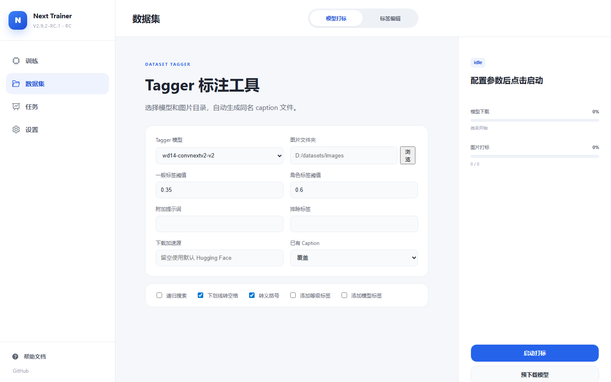
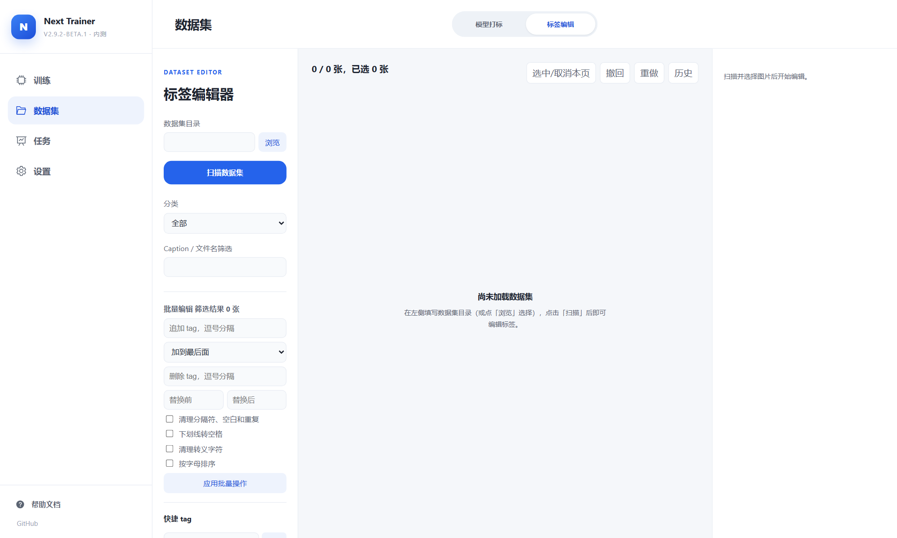
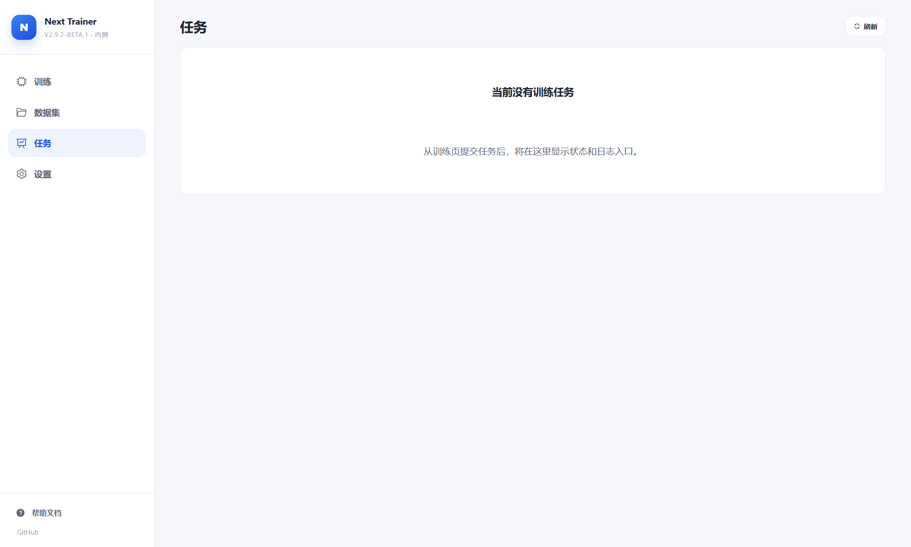

# Development Progress / 开发进展

[中文首页](../README-zh.md) · [English](../README.md) · [路线图](roadmap.md)

以下记录 `dev` 已集成的产品能力与边界，核对日期为 2026-10-01，不代表正式整合包已包含所有改动。历史发行说明保留在 [CHANGELOG](../CHANGELOG.md)；实际发布内容以 Release 为准。

## 近期更新

| 方向 | 已集成内容 | 边界 |
| --- | --- | --- |
| 引擎列表（#398） | 搜索、安装状态筛选、拖拽与键盘排序、置顶、恢复默认顺序、每页五项 | 顺序按浏览器及访问地址保存，不同步到其他设备，也不改变默认训练引擎 |
| Anima 选择（#394） | Anima 2B / 2.9B 路径引导，分别记忆自定义路径，恢复当前规格默认值 | 默认路径不下载模型；导入路径保留，无法识别规格时需要确认 |
| Kohya 独立环境（#392） | 引擎安装、修复、卸载与独立运行环境接入 | 不等于所有旧整合包已经完成共享依赖迁移或自动瘦身 |
| 整合包更新（#362） | Git 更新安全与便携启动脚本加固 | 不代表整个更新中心路线图已完成 |
| Qwen 图像编辑 | DiffSynth 目标图与参考图、训练预览、配置导入导出 | 当前是单卡 BF16 LoRA，Edit 使用 Batch 1 |

引擎列表验收：278 项前端测试、4 项 Python 包边界测试通过；真实 GUI 检查了拖拽、刷新、前端服务重启及新标签页恢复、移动端布局与深色主题。独立审查发现的拖回原位问题已修复并复核。该轮未执行真实安装、修复、卸载或训练，不替代生命周期专项验收。

## Dataset Workspace

### 路径与工具互通

数据集管理默认根目录为 `./datasets`，相对路径按应用目录解析。可改为其他磁盘上的目录；修改设置不会自动搬迁旧数据。根目录下的一级文件夹会自动识别为数据集，内部多层目录保留。

管理页可把数据集交给模型打标和标签编辑；训练时仍需按对应引擎的数据布局填写路径。管理页能够识别文件，不等于所有引擎都接受相同的训练目录结构。

### 上传、导出与删除

- 上传 PNG、JPG/JPEG、WebP、BMP 与 UTF-8 TXT，支持拖入多层文件夹并保留目录。
- 上传前集中列出冲突；默认不覆盖，用户明确选择后才覆盖，无需逐项确认。
- 上传包含单文件和整批限制、基本可读性检查、进度及失败项重试。
- 支持单文件下载及整集流式 ZIP 导出，排除回收站与临时文件。
- 文件或整个数据集可移入全局回收站；删除图片联动同名 TXT。
- 恢复不静默覆盖新文件；永久清空需要确认，管理操作串行化。
- 概览异步展示图片数、标注覆盖率、大小与更新时间。

### 首期限制

尚不包含 ZIP 上传解压、重命名、视频/音频管理、自然语言打标、训练表单的数据集选择器与完整校验，以及训练运行期间的数据写锁。训练过程中请勿修改或删除正在使用的数据。

## 训练与运行时

### Anima

Anima 底模选择适用于 Kohya LoRA、Anima Fast LoRA 和 Anima 全量微调。Anima Fast 另有明确的训练时长模式及验证集拆分配置；引擎参数与限制见 [Anima Fast 指南](anima-fast.md)。

### DiffSynth / Qwen-Image-2.1

- 支持完整模型目录或受支持的 BF16 DiT、文本编码器与 VAE 组件，Processor 资源自动管理。
- 文生图支持图片与同名 TXT 或 CSV / JSON / JSONL 元数据。
- Edit 使用目标输出图和一个或多个参考图，可通过目录配对或 `edit_image` 元数据描述。
- 支持缓存、CPU 卸载、分桶及训练预览。Edit 的有效批量可通过梯度累积增加。
- 当前不支持量化训练、全量微调或完整优化器状态恢复。

详细环境、参数和平台限制以 [DiffSynth 指南](diffsynth.md) 为准。

## 界面参考

以下为历史界面截图，用于说明工作流程，不代表当前页面逐像素外观；数据集管理首页与引擎列表已更新。

| 模型打标 | 标签编辑 |
| --- | --- |
|  |  |

